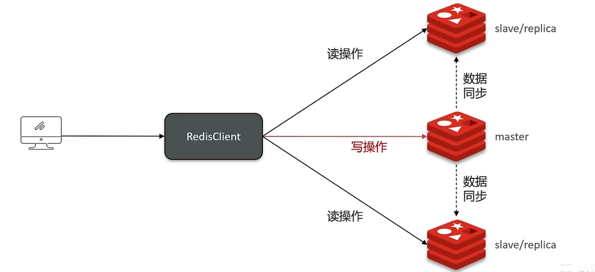

:::info[提示]

Redis 集群有哪些方案，知道嘛？

在 Redis 中提供的集群方案总共有三种

+ 主从复制
+ 哨兵模型
+ 分片集群

:::

**面试官喜欢问到的问题：**

:::tip[问题]

1. redis 主从数据同步的流程是什么？
2. 怎么保证 redis 的高并发、高可用？
3. 你们使用 redis 是单点还是集群，哪种集群？
4. redis 分片集群中数据是怎么存储何读取的？
5. redis 集群脑裂，该怎么解决呢？

:::

## 主从模式
单节点 Redis 的并发能力是有上限的，要进一步提高 Redis 的并发能力，就需要搭建主从集群，实现读写分离。

主节点（master）负责 redis 的写操作，从节点（slave）负责 redis 中的读操作。

当 master 节点接收到写操作的时候，需要把数据同步到从节点 slave 才行，必须保证 master 与 slave 的数据一致性。

## 主从数据同步原理
### 主从全量同步
**Replication Id：** 简称 replid，是数据集的标记，id 一致则说明是同一数据集。每一个 master 都有唯一的 replid，slave 则会继承 master 节点的 replid

**offset：** 偏移量，随着记录在 repl_baklog 中的数据增多而逐渐增大。slave 完成同步时也会记录当时同步的 offset。如果 slave 的 offset 小于 master 的 offset，说明 slave 数据落后于 master，需要更新。

### 主从增量同步（slave 重启或后期数据变化）

:::tip[面试场景]

**介绍一下 redis 的主从同步**

单节点 Redis 的并发能力是有上限的，要进一步提高 Redis 的并发能力，就需要搭建主从集群，实现读写分离。一般都是一主多从，主节点负责**写数据**，从节点负责**读数据**。

**能说一下，主从同步数据的流程吗？**

**全量同步：**

1. 从节点请求主节点同步数据（replication id、offset）
2. 主节点判断是否是第一次请求，是第一次就与从节点同步版本信息（replication id和offset）
3. 主节点执行 bgsave，生成 rdb 文件后，发送给从节点去执行
4. 在 rdb 生成执行期间，主节点会以命令的方式记录到缓冲区（一个日志文件 repl_baklog）
5. 把生成之后的命令日志文件发送给从节点进行同步

**增量同步：**

1. 从节点请求主节点同步数据，主节点判断不是第一次请求，不是第一次就获得从节点的 offset 值
2. 主节点从命令日志中获取 offset 值之后的数据，发送给从节点进行数据同步

:::

## 面试场景
:::tip[面试场景]

**面试官:** Redis 集群有哪些方案,知道嘛？

**候选人:** 嗯~~，在 Redis 中提供的集群方案总共有三种:主从复制、哨兵模式、Redis 分片集群

**面试官:** 那你来介绍一下主从同步

**候选人:** 嗯，是这样的，单节点 Redis 的并发能力是有上限的，要进一步提高 Redis 的并发能力，可以搭建主从集群，实现读写分离。一般都是一主多从，主节点负责写数据，从节点负责读数据，主节点写入数据之后，需要把数据同步到从节点中

**面试官:** 能说一下，主从同步数据的流程

**候选人:** 嗯~~，好!主从同步分为了两个阶段，一个是全量同步，一个是增量同步

全量同步是指从节点第一次与主节点建立连接的时候使用全量同步，流程是这样的:

第一：从节点请求主节点同步数据，其中从节点会携带自己的 replication id 和 offset 偏移量。

第二：主节点判断是否是第一次请求，主要判断的依据就是，主节点与从节点是否是同一个 replicatiorid，如果不是，就说明是第一次同步，那主节点就会把自己的 replication id 和 offset 发送给从节点，让从节点与主节点的信息保持一致。

第三:在同时主节点会执行 bgsave，生成 rdb 文件后，发送给从节点去执行，从节点先把自己的数据清空，然后执行主节点发送过来的 rdb 文件，这样就保持了一致

当然，如果在 rdb 生成执行期间，依然有请求到了主节点，而主节点会以命令的方式记录到缓冲区，缓冲区是一个日志文件，最后把这个日志文件发送给从节点，这样就能保证主节点与从节点完全一致了，后期再同步数据的时候，都是依赖于这个日志文件，这个就是全量同步

增量同步指的是，当从节点服务重启之后，数据就不一致了，所以这个时候，从节点会请求主节点同步数据，主节点还是判断不是第一次请求，不是第一次就获取从节点的 offset 值，然后主节点从命令日志中获取 offset 值之后的数据，发送给从节点进行数据同步

:::

---

