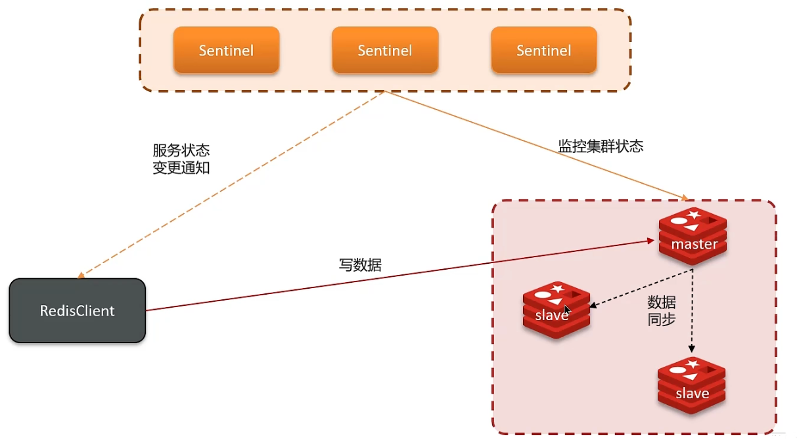

Redis提供了哨兵（Sentinel）机制来实现主从集群的自动故障恢复。哨兵的结构和作用如下：

+ **监控：** Sentinel 会不断检查您的 master 和 slave 是否按预期工作
+ **自动故障恢复：** 如果 master 故障，Sentinel 会将一个 slave 提升为 master。当故障实例恢复后也以新的 master 为主
+ **通知：** Sentinel 充当 Redis 客户端的服务发现来源，当集群发生故障转移时，会将最新信息推送给 Redis 客户端

## 服务状态监控
Sentinel 基于心跳机制监测服务状态，每隔1秒向集群的每个实例发送 ping 命令：

+ **主观下线：**如果某 sentinel 节点发现某实例未在规定时间响应，则认为该实例**主观下线**。
+ **客观下线：**若超过指定数量（quorum）的 sentinel 都认为该实例主观下线，则该实例**客观下线**。quorum 值最好超过 Sentinel 实例数量的一半。

**哨兵选主规则**

+ 首先判断主与从节点断开时间长短，如超过指定值就排该从节点
+ 然后判断从节点的 slave-priority 值，越小优先级越高
+ 如果 slave-prority 一样，则判断 slave 节点的 offset 值，越大优先级越高
+ 最后是判断 slave 节点的运行 id 大小，越小优先级越高

## Redis集群（哨兵模式）脑裂
当 sentinel 与 master 网络出现了问题，而客户端 RedisClient 还能正常连接，就会出现脑裂现象，也就是客户端写入数据是在 master 中，而 sentinel 因为网络问题监控不到老的 master，会推出一个新的 master。这样就会出现两个 master。

而当网络恢复之后，哨兵会将老的 master 强制降为 slave，这时降为 slave 的节点会同步 master 数据，从而将之前客户端写入的数据丢失

**解决方法：**

我们可以修改 redis 中的两个配置参数：

+ min-replicas-to-write 1		表示最少的slave节点为1个（即主节点至少有一个slave才能接收新的数据）
+ min-replicas-max-lag 5		表示数据复制和同步的延迟不能超过5秒

:::tip[面试场景]

**怎么保证 Redis 的高并发高可用**

哨兵模式：实现主从集群的自动故障恢复（监控、自动故障恢复、通知）

**你们使用 redis 是单点还是集群，哪种集群**

主从（1主1从）+ 哨兵就可以了。单节点不超过 10G 内存，如果 Redis 内存不足则可以给不同服务分配独立的 Redis 主从节点

**redis 集群脑裂，该怎么解决呢？**

集群脑裂是由于主节点和从节点和 sentinel 处于不同的网络分区，使得 sentinel 没有能够心跳感知到主节点，所以通过选举的方式提升了一个从节点为主，这样就存在了两个 master，就像大脑分裂了一样，这样会导致客户端还在老的主节点那里写入数据，新节点无法同步数据，当网络恢复后，sentinel 会将老的主节点降为从节点，这时再从新 master 同步数据，就会导致数据丢失

**解决︰** 我们可以修改 redis 的配置，可以设置最少的从节点数量以及缩短主从数据同步的延迟时间，达不到要求就拒绝请求，就可以避免大量的数据丢失

:::

## 面试场景
:::tip[面试场景]

**面试官：** 怎么保证 redis 的高并发高可用

**候选人：** 首先可以搭建主从集群，再加上使用 redis 中的哨兵模式，哨兵模式可以实现主从集群的自动故障恢复，里面就包含了对主从服务的监控、自动故障恢复、通知；如果 master 故障，Sentinel 会将一个 slave 提升为提升为 master。当故障实例恢复后也以新 master 的为主；同时 Sentinel 也充当 redis 客户端的服务发现来源，当集群发生故障转移时，会将最新信息推送给 Redis 的客户端，所以一般项目都会采用哨兵的模式来保证 redis 的高并发高可用

**面试官：** 你们使用 redis 是单点还是集群，哪种集群

**候选人：** 嗯！，我们当时使用的是主从(1主1从)加哨兵。一般单节点不超过 10G 内存，如果 redis 内存不足则可以给不同服务分配独立的 Redis 主从节点。尽量不做分片集群。因为集群维护起来比较麻烦，并且集群之间的心跳检测和数据通信会消耗大量的网络带宽，也没有办法使用 lua 脚本和事务

**面试官：** redis 集群脑裂，该怎么解决呢？

**候选人：** 嗯！这个在项目很少见，不过脑裂的问题是这样的，我们现在用的是 redis 的哨兵模式集群的有的时候由于网络等原因可能会出现脑裂的情况，就是说，由于 redis master 节点和 redis salve 节点和 Sentinel 处于不同的网络分区，使得 Sentinel 没有能够心跳感知到 Master，所以通过选举的方式提升了一个 salve 为 Master，这样就存在了两个 Master，就像大脑分裂了一样，这样会导致客户端还在老主人那里写入数据，新节点无法同步数据，当网络恢复后，哨兵会将老主人降为 Salve，这时再从新大师同步数据，这会导致老主人中的大量数据丢失。

关于解决的话，我记得在 redis 的配置中可以设置：第一可以设置最少的 salve 节点个数，比如设置至少要有一个从节点才能同步数据，第二个可以设置主从数据复制和同步的延迟时间，达不到要求就拒绝请求，就可以避免大量的数据丢失

:::

