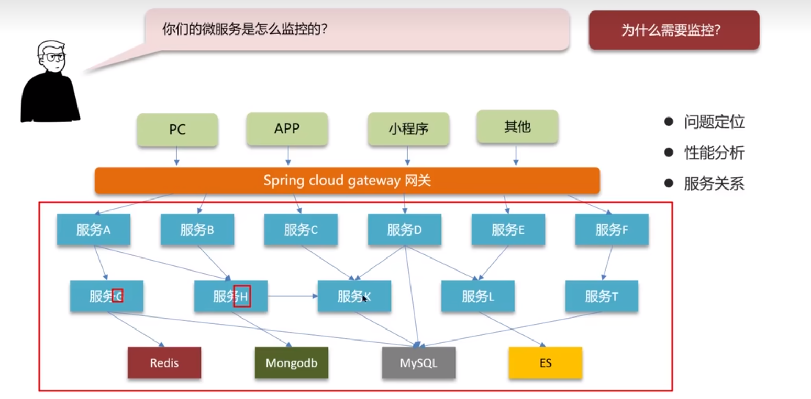
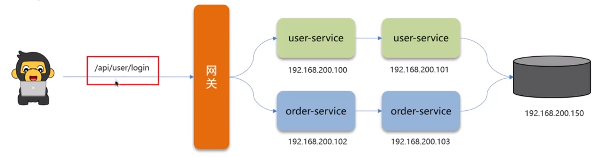

**🗨️** **你们的微服务是怎么监控的？**

**为什么需要监控?**

+ 问题定义
+ 性能分析
+ 服务关系
+ 服务告警

**常见的服务监控工具**

+ **Springboot-admin**
+ **prometheus+Grafana**
+ **zipkin**
+ **skywalking**

## skywalking
一个分布式系统的应用程序性能监控工具(Application Performance Managment )，提供了完善的链路追踪能力, apache的顶级项目(前华为产品经理吴晟主导开源)。

+ **服务(service) :业务资源应用系统（微服务)**
+ **端点(endpoint) :应用系统对外暴露的功能接口(接口)**
+ **实例(instance)︰物理机**

****

****

## 面试场景
**🗨️** **你们的微服务是怎么监控的？**

我们项目中采用的 skywalking 进行监控的

1. skywalking 主要可以监控接口、服务、物理实例的一些状态。特别是在压测的时候可以看到众多服务中哪些服务和接口比较慢，我们可以针对性的分析和优化。
2. 我们还在 skywalking 设置了告警规则，特别是在项目上线以后，如果报错，我们分别设置了可以给相关负责人发短信和发邮件，第一时间知道项目的bug情况，第一时间修复