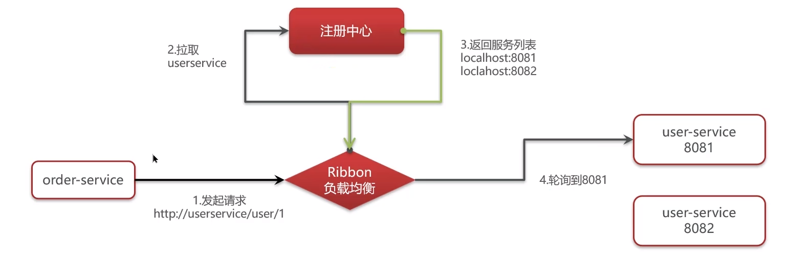
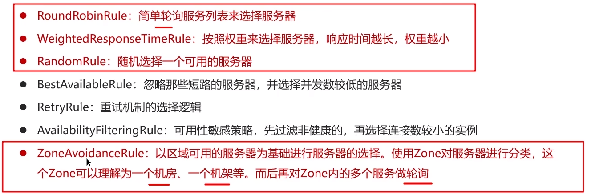
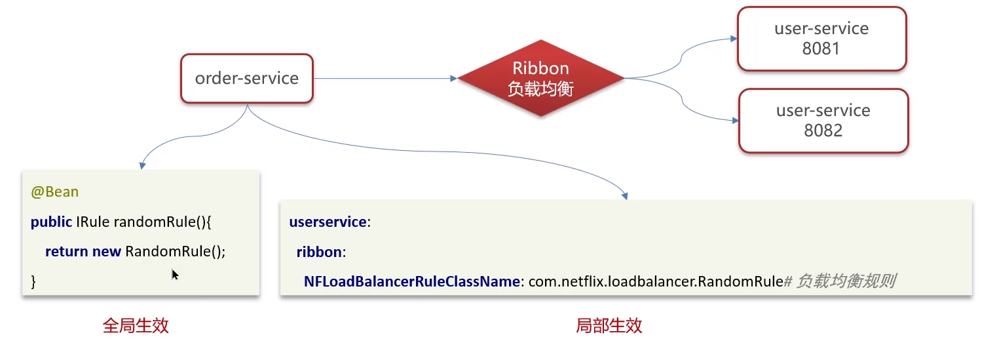

**🗨️** **你们项目负载均衡如何实现的?**

+ 负载均衡 Ribbon,发起远程调用 feign 就会使用 Ribbon
+ Ribbon 负载均衡策略有哪些?
+  如果想自定义负载均衡策略如何实现?

**🗨️** **Ribbon 负载均衡策略有哪些？**

**🗨️** **如果想自定义负载均衡策略如何实现？**

**可以自己创建类实现 IRule 接口，然后再通过配置类或者配置文件配置即可，通过定义 IRule 实现可以修改负载均衡规则，有两种方式:**

