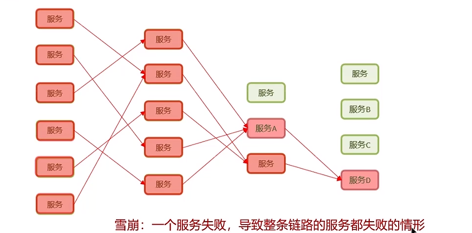
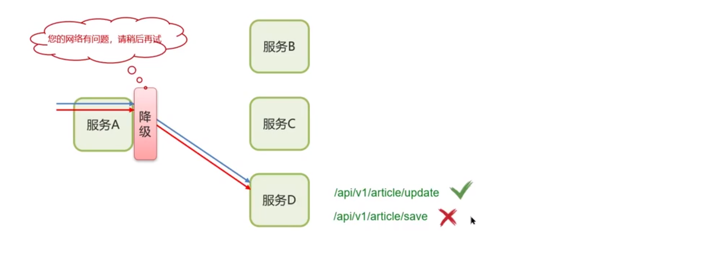
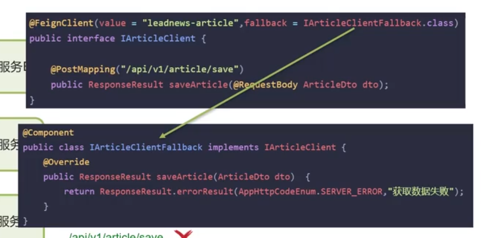
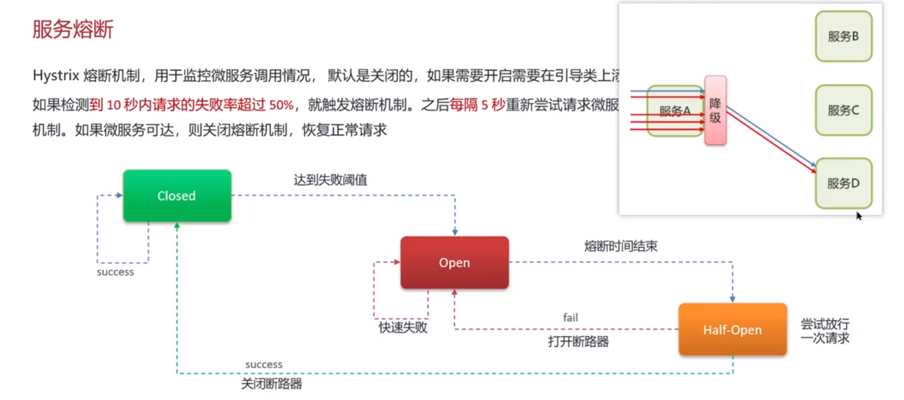

**🗨️** **什么是服务雪崩，怎么解决这个问题？**

+ 什么是服务雪崩?
+ 熔断降级（解决)	Hystix 服务熔断降级
+ 限流（预防)

## 服务降级
服务降级是服务自我保护的一种方式，或者保护下游服务的一种方式，用于确保服务不会受请求突增影响变得不可用，确保服务不会崩溃。

如果降级太多，则会触发熔断机制。

## 服务熔断
Hystrix 熔断机制，用于监控微服务调用情况，默队是关闭的，如果需要开启需要在引导类上添加注解: @EnableCircuitBreaker 如果检测到 10 秒内请求的失败率超过 50%，就触发熔断机制。之后每隔 5 秒重新尝试请求微服务，如果微服务不能响应，继续走熔断机制。如果微服务可达，则关闭熔断机制，恢复正常请求。

**🗨️** **什么是服务雪崩，怎么解决这个问题？**

+ **服务雪崩:一个服务失败，导致整条链路的服务都失败的情形**
+ **服务降级︰服务自我保护的一种方式，或者保护下游服务的一种方式，用于确保服务不会受请求突增影响变得不可用，确保服务不会崩溃，一般在实际开发中与 feign 接口整合，编写降级逻辑**
+ **服务熔断∶默认关闭，需要手动打开，如果检测到 10 秒内请求的失败率超过 50%，就触发熔断机制。之后每隔 5 秒重新尝试请求微服务，如果微服务不能响应，继续走熔断机制。如果微服务可达，则关闭熔断机制，恢复正常请求**

