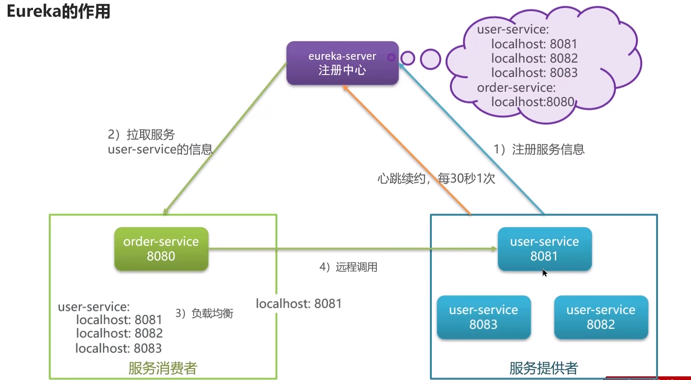
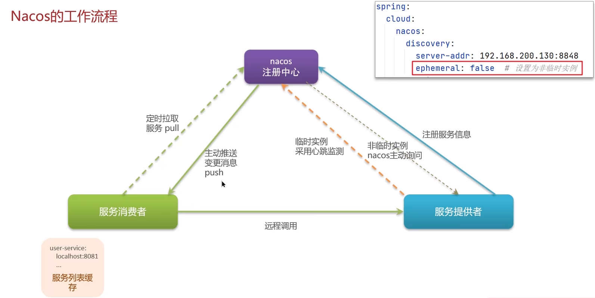

**🗨️** **服务注册和发现是什么意思? Spring Cloud如何实现服务注册发现?**

+ 微服务中必须要使用的组件，考察我们使用微服务的程度
+ 注册中心的核心作用是:服务注册和发现
+ 常见的注册中心: eureka、nocas、zookeeper

我做过的哪个微服务项目，使用了哪个注册中心

### Eureka 的作用

### 面试场景
**🗨️** **服务注册和发现是什么意思? Spring Cloud 如何实现服务注册发现?**

+ 我们当时项目采用的 eureka 作为注册中心，这个也是 spring cloud 体系中的一个核心组件
+ **服务注册:** 服务提供者需要把自己的信息注册到 eureka，由 eureka 来保存这些信息，比如服务名称、ip、端口等等
+ **服务发现:** 消费者向 eureka 拉取服务列表信息，如果服务提供者有集群，则消费者会利用负载均衡算法，选择一个发起调用
+ **服务监控:** 服务提供者会每隔 30 秒向 eureka 发送心跳，报告健康状态，如果 eureka 服务 90 秒没接收到心跳，从 eureka 中剔除

**🗨️** **我看你之前也用过 nacos、你能说下 nacos 与 eureka 的区别?**

+ **简历上有体现**
+ **面试官比较熟悉 nacos 和 eureka**

****

### Nacos 的工作流程

### 面试场景
**🗨️** **我看你之前也用过 nacos、你能说下 nacos 与 eureka 的区别?**

+ Nacos 与 eureka 的共同点（注册中心)
    - 都支持服务注册和服务拉取
    - 都支持服务提供者心跳方式做健康检测
+ Nacos 与 Eureka 的区别（注册中心)
    1. Nacos 支持服务端主动检测提供者状态:临时实例采用心跳模式，非临时实例采用主动检测模式
    2. 临时实例心跳不正常会被剔除，非临时实例则不会被剔除
    3. Nacos 支持服务列表变更的消息推送模式，服务列表更新更及时
    4. Nacos 集群默认采用 AP 方式，当集群中存在非临时实例时，采用 CP 模式;Eureka 采用 AP 方式
+ Nacos 还支持了配置中心，eureka 则只有注册中心，也是选择使用 nacos 的一个重要原因
