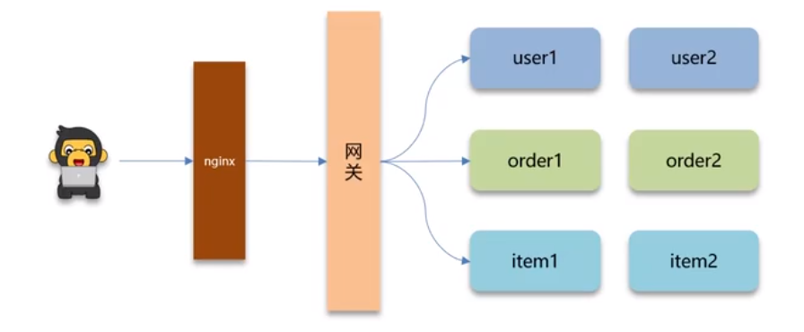
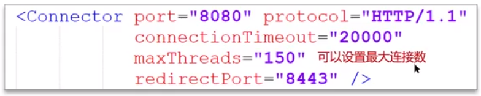
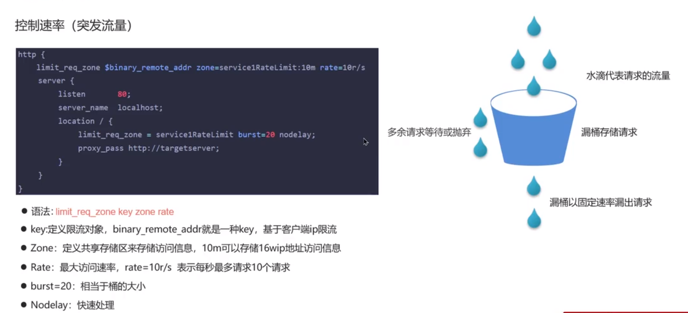
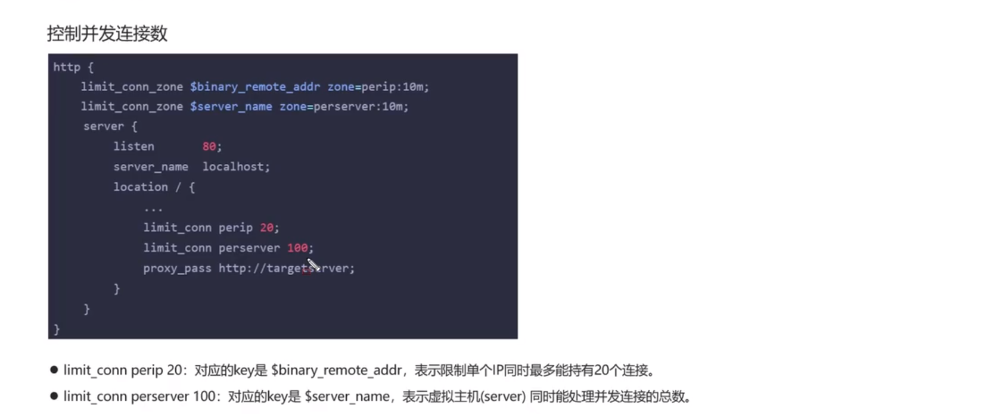
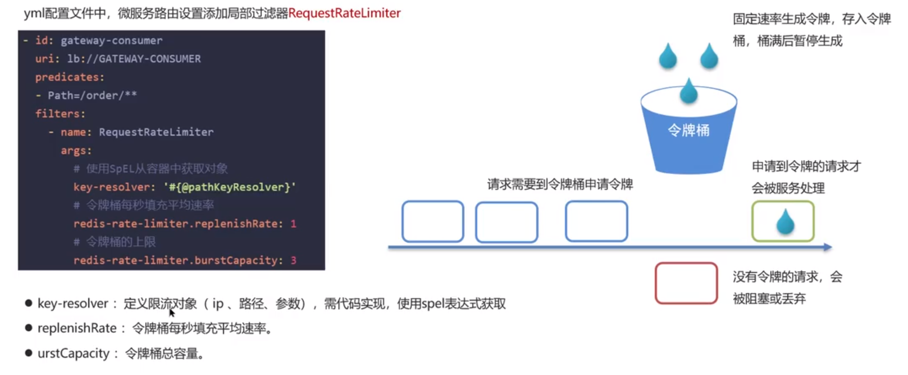

**🗨️** **你们项目中有没有做过限流呢？怎么做的？**

**为什么要限流?**

1. **并发的确大(突发流量)、**
2. **防止用户恶意刷接口**

****

**限流的实现方式:**

+ **Tomcat:可以设置最大连接数**
+ **Nginx，漏桶算法**
+ **网关，令牌桶算法**
+ **自定义拦截器**

## Nginx 限流
### 控制速率（突发流量）

### 控制并发连接数

## 网关限流
yml配置文件中，微服务路由设置添加局部过滤器RequestRateLimiter

**🗨️** **你们项目中有没有做过限流呢？怎么做的？**

1. **先来介绍业务，什么情况下去做限流，需要说明QPS具体多少**
+ 我们当时有一个活动，到了假期就会抢购优惠券，QPS最高可以达到2000，平时10-50之间，为了应对突发流量,需要做限流
+ 常规限流，为了防止恶意攻击，保护系统正常运行，我们当时系统能够承受最大的QPS是多少(压测结果)
2. **nginx 限流**
+ 控制速率（突发流量)，使用的漏桶算法来实现过滤，让请求以固定的速率处理请求，可以应对突发流量
+ 控制并发数，限制单个ip的链接数和并发链接的总数
3. **网关限流**
+ 在spring cloud gateway 中支持局部过滤器RequestRateLimiter来做限流，使用的是令牌桶算法·
+ 可以根据ip或路径进行限流，可以设置每秒填充平均速率，和令牌桶总容量

**🗨️** **限流常见的算法有哪些呢？**
