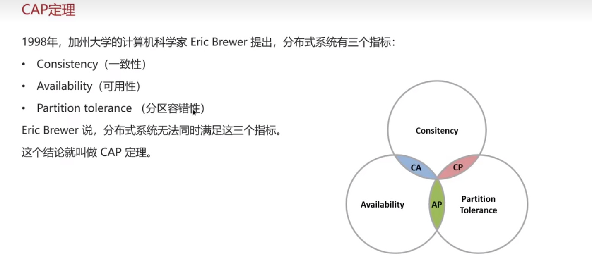
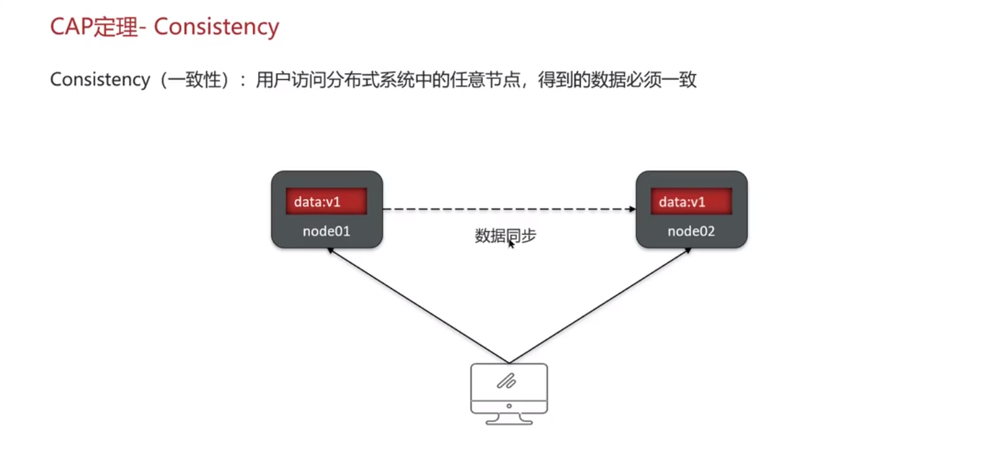
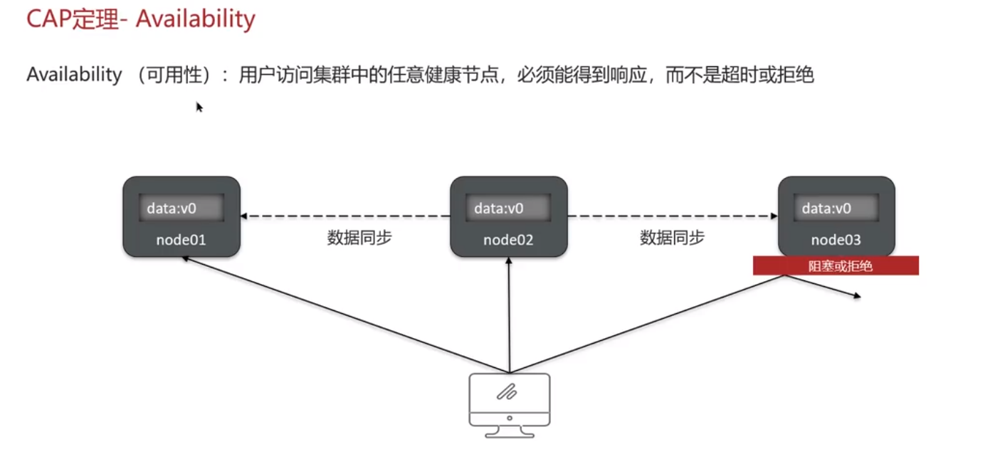
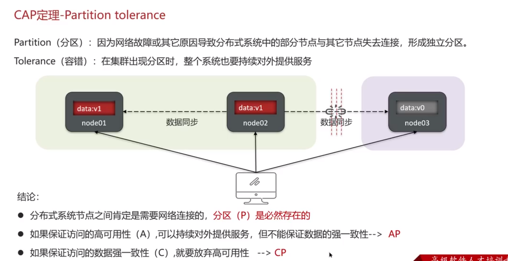
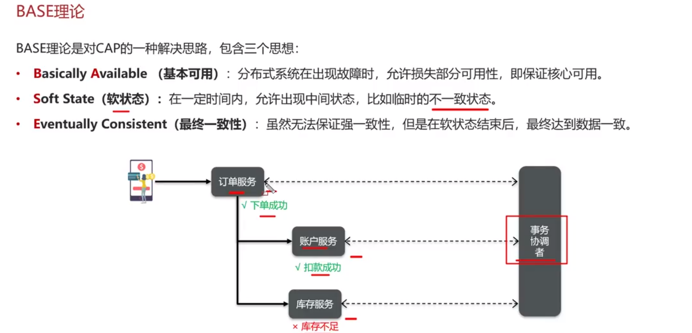

**🗨️** **解释一下 CAP 和 BASE**

+ **分布式事务方案的指导**
+ **分布式系统设计方向**
+ **根据业务指导使用正确的技术选择**

****

## CAP 定理

### CAP 定理-Consistency

### CAP定理-Avaliability

### CAP定理-Partition tolerance

## BASE 理论

## 面试场景
**🗨️** **解释一下 CAP 和 BASE**

+ CAP定理(一致性、可用性、分区容错性)
    -  分布式系统节点通过网络连接，一定会出现分区问题(P)
    - 当分区出现时，系统的一致性(C）和可用性(A）就无法同时满足
+ BASE理论
    - 基本可用
    - 软状态
    - 最终一致
+ 解决分布式事务的思想和模型:
    - 最终一致思想:各分支事务分别执行并提交，如果有不一致的情况，再想办法恢复数据（AP)
    - 强一致思想:各分支事务执行完业务不要提交，等待彼此结果。而后统一提交或回滚（CP)
