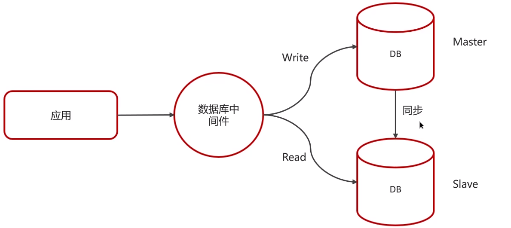
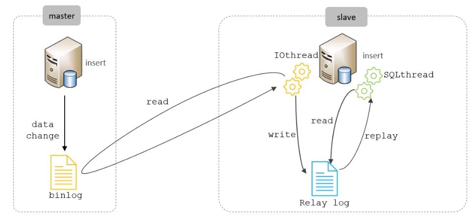

**🗨️** **MySQL 主从同步原理**

### 主从同步原理

**MySQL 主从复制的核心就是二进制日志**

:::tip

二进制日志（BINLOG）记录了所有的 DDL（数据定义语言）语句和 DML（数据操纵语言）语句，但不包括数据查询（SELECT、SHOW）语句

:::

复制分成三步：

1. Master 主库在事务提交时，会把数据变更记录在二进制日志文件 Binlog 中。
2. 从库读取主库的二进制日志文件 Binlog，写入到从库的中继日志 Relay Log。
3. slave 重做中级日志中的事件，将改变反映它自己的数据。

### 面试场景
**🗨️** **MySQL 主从同步原理**

**MySQL 主从复制的核心就是二进制日志 binlog（DDL（数据定义语言）语句和 DML（数据操纵语言）语句）**

1. **主库在事务提交时，会把数据变更记录在二进制日志文件 Binlog 中。**
2. **从库读取主库的二进制日志文件 Binlog，写入到从库的中继日志 Relay Log。**
3. **从库重做中继日志中的事件，将改变反映它自己的数据。**

****

