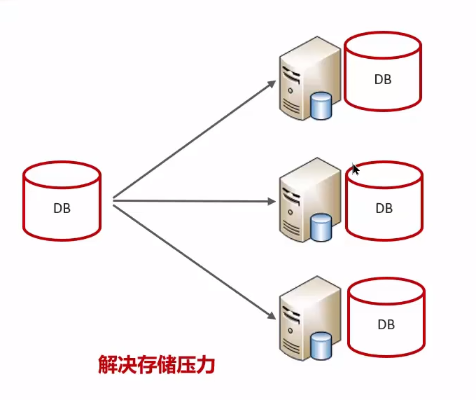
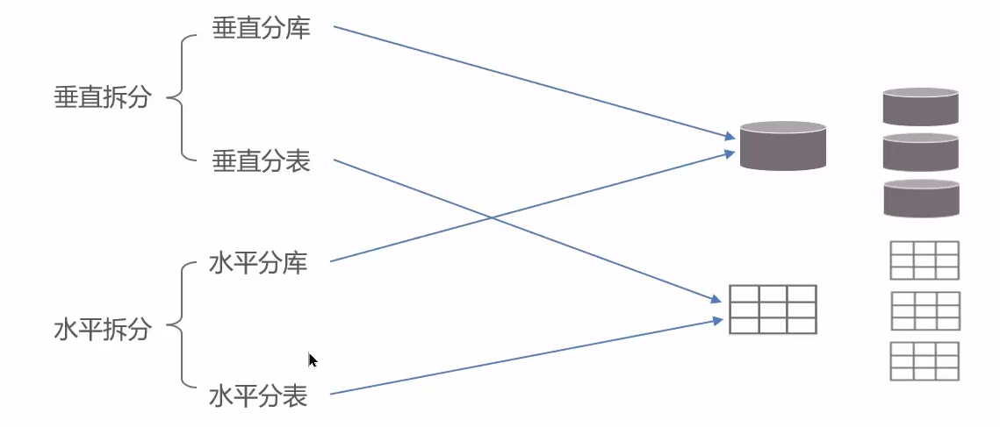
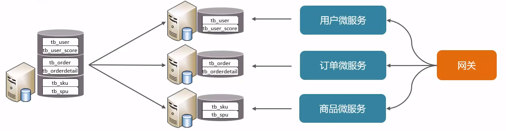
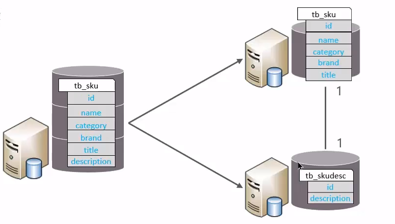
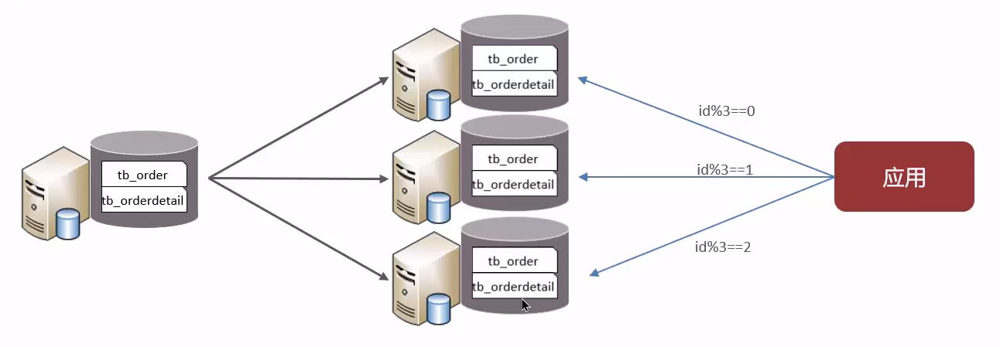
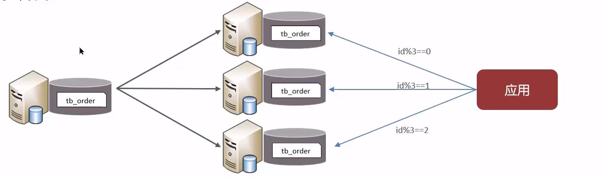
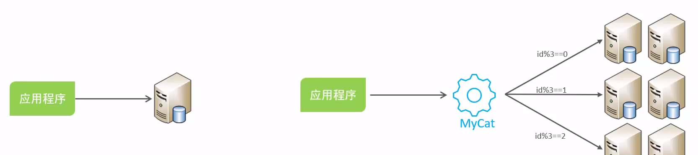

**🗨️** **你们项目用过分库分表吗**

**分库分表的时机：**

1. **前提**，项目业务数据逐渐增多，或业务发展比较迅速	**（单表的数据量达 1000W 或 20G 以后）**
2. 优化已解决不了性能问题（主从读写分离、查询索引...）
3. IO 瓶颈（磁盘 IO、网络 IO）、CPU 瓶颈（聚合查询、连接数太多）

### 拆分策略

### 垂直拆分
+ **垂直分库**

**垂直分库：** **以表为依据，根据业务将不同表拆分到不同库中**

**特征：**

1. 按照业务对数据分级管理、维护、监控、扩展
2. 在高并发下，提高磁盘 IO 和数据量连接数

****

+ **垂直分表**

**垂直分表：** **以字段为依据，根据字段属性将不同字段拆分到不同表中**

**拆分规则：**

+ 把不常用的字段单独放在一张表
+ 把 text、blob 等大字段拆分出来放在附表中

**特点：**

1. 冷热数据分离
2. 减少 IO 过渡争抢，两表互不影响

### 水平拆分
+ **水平分库**

**水平分库：** 将一个库的数据拆分到多个库中。

**路由规则：**

1. 根据 id 节点取模
2. 按 id 也就是范围路由，节点 1（1-100 万），节点 2（100 万-200 万）

**特点：**

1. 解决了单库大数量，高并发的性能瓶颈问题
2. 提高了系统的稳定性和可用性

+ **水平分表**

**水平分表：** 将一个表的数据拆分到多个表中（可以在同一个库内）。

**特点：**

1. 优化单一表数据量过大而产生的性能问题；
2. 避免 IO 争抢并减少锁表的几率；

### 分库分表的策略有哪些

+ **新的问题和新的技术**

**分库之后的问题：**

    - 分布式事务一致性问题
    - 跨节点关联查询
    - 跨节点分页、排序函数
    - 主键避重

****

+ **分库分表中间件：**
    - sharding-sphere
    - mycat

****

### 面试场景
**🗨️** **你们项目用过分库分表吗**

+ **业务介绍**
    1. 根据自己简历上的项目，想一个数据量较大业务（请求数多或业务累计大）
    2. 达到了什么样的量级（单表 1000 万或超过 20G）
+ **具体拆分策略**
    1. 水平分库，将一个库的数据拆分到多个库中，解决海量数据存储和高并发的问题
    2. 水平分表，解决单表存储和性能的问题
    3. 垂直分库，根据业务进行拆分，高并发下提高磁盘 IO 和网络连接数
    4. 垂直分表，冷热数据分离，多表互不影响

