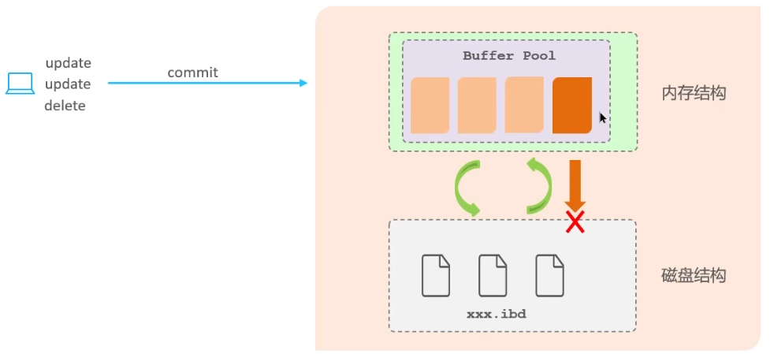
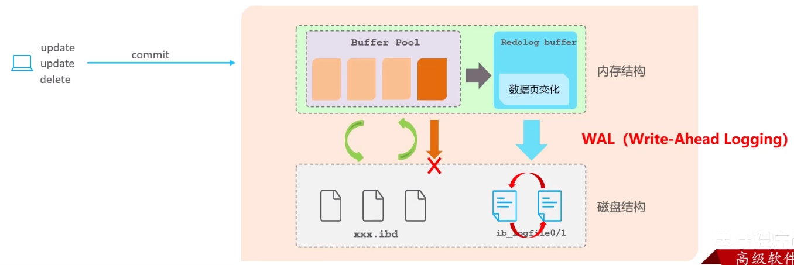

**🗨️** **undo log 和 redo log 的区别**

首先，mysql 中有两个概念需要知道一下：

+ **缓冲池（buffer pool）：** 主内存中的一个区域，里面可以缓存磁盘上经常操作的真实数据，在执行增删改查操作时，先操作缓冲池中的数据（若缓冲池没有数据，则从磁盘加载并缓存），以一定频率刷新到磁盘，从而减少磁盘 IO，加快处理速度
+ **数据页（page）：** 是 InnoDB 存储引擎磁盘管理的最小单元，每个页的大小默认为 16KB。页中存储的是行数据

### redo log
重做日志，记录的是事务提交时数据页的物理修改，是**用来实现事务的持久性。**

该日志文件由两部分组成：重做日志缓冲（redo log buffer）以及重做日志文件（redo log file），前者是在内存中，后者在磁盘中。当事务提交之后会把所有修改信息都存到该日志文件中，用于在刷新脏页到磁盘，发生错误时，进行数据恢复使用。

### undo log
回滚日志，用于记录数据被修改前的信息，作用包含两个：提供回滚 和 MVCC（多版本并发控制）。undo log 和 redo log 记录物理日志不一样，它是逻辑日志。

+ 可以认为当 delete 一条记录时，undo log 中会记录一条对应的 insert 记录，反之亦然，
+ 当 update 一条记录时，它记录一条对应相反的 update 记录。当执行 rollback 时，就可以从 undo log 中的逻辑记录读取到相应的内容，并进行回滚。

**undo log 可以实现事务的一致性和原子性**

****

### 面试场景
**🗨️** **undo log 和 redo log 的区别**

+ **redo log：** 记录的是数据页的物理变化，服务宕机可以用来同步数据
+ **undo log：** 记录的是逻辑日志，当事务回滚时，通过逆操作恢复原来的数据
+ **redo log 保证了事务的持久性，undo log 保证了事务的原子性和一致性**

****

:::success[面试场景]

**面试官: undo log 和 redo log的区别**

**候选人:** 好的，其中 redo log 日志记录的是数据页的物理变化，服务宕机可用来同步数据，而 undo log 不同，它主要记录的是逻辑日志，当事务回滚时，通过逆操作恢复原来的数据，比如我们删除一条数据的时候，就会在 undo log 日志文件中新增一条 delete 语句，如果发生回滚就执行逆操作;

redo log 保证了事务的持久性，undo log 保证了事务的原子性和一致性

:::

