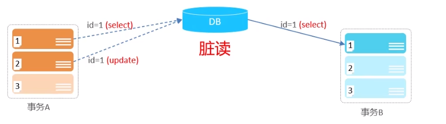
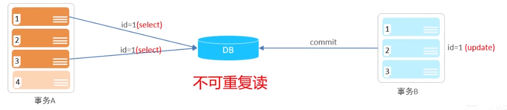
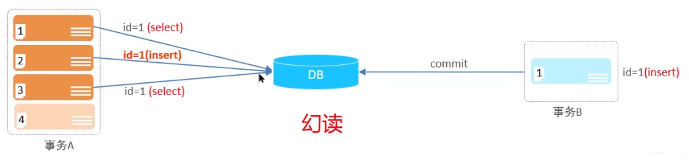
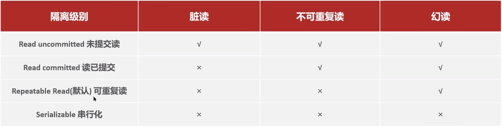

**🗨️** **并发事务带来了哪些问题？怎么解决这些问题？MySQL 的默认隔离级别是？**

+ **并发事务问题：脏读、不可重复读、幻读**
+ **隔离级别：读未提交、读已提交、****可重复读****、串行化**

### 并发事务问题
| 问题 | 描述 |
| :--- | :--- |
| 脏读 | 一个事务读到另一个事务还没有提交的数据 |
| 不可重复读 | 一个事务先后读取同一条记录，但两次读取的数据不同，称之为不可重复读 |
| 幻读 | 一个事务按照条件查询数据时，没有对应的数据行，但是在插入数据时，又发现这行数据已经存在，好像出现了“幻影” |

#### 脏读

#### 不可重复读

#### 幻读

### 怎么解决并发事务的问题呢？
解决方案：对事务进行隔离

注意：事务隔离级别越高，数据越安全，但是性能越低。

### 面试场景
**🗨️** **并发事务带来了哪些问题？怎么解决这些问题？MySQL 的默认隔离级别是？**

+ **并发事务的问题：**
    - **脏读：** 一个事务读到另一个事务还没有提交的数据
    - **不可重复读：** 一个事务先后读取同一条记录，但两次读取的数据不同
    - **幻读：** 一个事务按照条件查询数据时，没有对应的数据行，但是在插入数据时，又发现这行数据已经存在，好像出现了“幻影”
+ **隔离级别：**
    - READ UNCOMMITTED	读未提交		脏读、不可重复读、幻读
    - READ COMMITTED		读已提交		不可重复读、幻读
    - REPEATABLE READ		可重复读		幻读
    - SERIALIZABLE			串行化

:::success[面试场景]

**面试官:并发事务带来哪些问题?**

**候选人:**

我们在项目开发中，多个事务并发进行是经常发生的，并发也是必然的，有可能导致一些问题

**第一是脏读**，当一个事务正在访问数据并且对数据进行了修改，而这种修改还没有提交到数据库中，这时另外一个事务也访问了这个数据，因为这个数据是还没有提交的数据，那么另外一个事务读到的这个数据是“脏数据”，依据"脏数据"所做的操作可能是不正确的。

**第二是不可重复读:** 比如在一个事务内多次读同一数据。在这个事务还没有结束时，另一个事务也访问该数据。那么，在第一个事务中的两次读数据之间，由于第二个事务的修改导致第一个事务两次读取的数据可能不太一样。这就发生了在一个事务内两次读到的数据是不一样的情况，因此称为不可重复读。

**第三是幻读(Phantom read):** 幻读与不可重复读类似。它发生在一个事务(T1）读取了几行数据，接着另一个并发事务（T2）插入了一些数据时。在随后的查询中，第一个事务(T1）就会发现多了一些原本不存在的记录，就好像发生了幻觉一样，所以称为幻读。

面试官:怎么解决这些问题呢？MySQL 的默认隔离级别是？候选人:解决方案是对事务进行隔离

MySQL 支持四种隔离级别，分别有:

第一个是，未提交读(read uncommitted）它解决不了刚才提出的所有问题，一般项目中也不用这个。

第二个是读已提交（read committed）它能解决脏读的问题的，但是解决不了不可重复读和幻读。

第三个是可重复读（repeatable read）它能解决脏读和不可重复读，但是解决不了幻读，这个也是 mysql 默认的隔离级别。

第四个是串行化 (serializable) 它可以解决刚才提出来的所有问题，但是由于让是事务串行执行的，性能比较低。所以，我们一般使用的都是 mysql 默认的隔离级别:可重复读

:::

