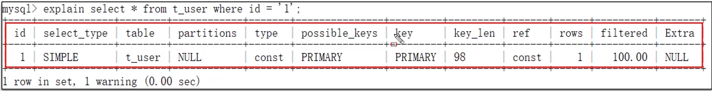

面试官可能会问道的问题：

我们可以使用以下几种方法来解决慢查询的问题：

+ **聚合查询**
+ **多表查询**
+ **表数据量过大查询**
+ **深度分页查询**

上述中，聚合查询、多表查询、表数据量过大查询可以使用 **SQL 执行计划**来找到慢的原因

## SQL 执行计划
可以采用 EXPLAIN 或者 DESC 命令获得 MySQL 如何执行 SELECT 语句的信息

具体语法：

:::success

- 直接在select语句之前加上关键字 explain/desc

EXPLAIN SELECT 字段列表 FROM 表名 WHERE 条件;

:::

下面是运行 explain 所生成的结果：

+ possible_key	当前 sql 可能会使用到的索引
+ **key			当前 sql 实际命中的索引**
+ **key_len		当前使用到的索引实际占用的大小**

**通过 key 和 key_len 两个属性查看当前 sql 语句是否可能会命中索引**

+ Extra		额外的优化建议

| **Extra** | **含义** |
| --- | --- |
| Using where; Using Index | 查找使用了索引，需要的数据都在索引列中能找到，不需要回表查询数据 |
| Using index condition | 查找使用了索引，但是需要徽标查询数据 |

+ type			这条 sql 的连接的类型，性能由好到差为 NULL、system、const、eq_ref、ref、range、				index、all
    - system：	查询 mysql 中内置的系统表
    - const：	根据主键索引查询
    - eq_ref：	主键索引查询或唯一索引查询
    - ref：	索引查询（可能可以查询出来多条数据）
    - range：	范围查询（sql 执行的时候走的是索引，但是是范围查询）
    - index：	索引数扫描
    - all：		全盘扫描

## 面试场景
:::success[面试场景]

**面试官：这条 SQL 语句执行很慢，如何分析呢？**

可以采用 MYSQL 自带的分析工具 EXPLAIN

+ 通过 key 和 key_len 检查是否命中了索引（索引本身存在是否有失效的情况）
+ 通过 type 字段查看 sql 是否有进一步的优化空间，是否存在全索引扫描或全盘扫描
+ 通过 extra 建议判断，是否出现了回表的情况，如果出现了，可以尝试添加索引或修改返回字段来修复

:::

:::success

**面试官：那这个 SQL 语句执行很慢，如何分析呢？**

候选人：如果一条 sql 执行很慢的话，我们通常会使用 mysql 自动的执行计划 explain 来去查看这条 sql 的执行情况，比如在这里面可以通过 key 和 key_len 检查是否命中了索引，如果本身已经添加了索引，也可以判断索引是否有失效的情况。

第二个，可以通过 type 字段查看 sql 是否有进一步的优化空间，是否存在全索引扫描或全盘扫描。

第三个可以通过 extra 建议来判断，是否出现了回表的情况，如果出现了，可以尝试添加索引或修改返回字段来修复。

:::

