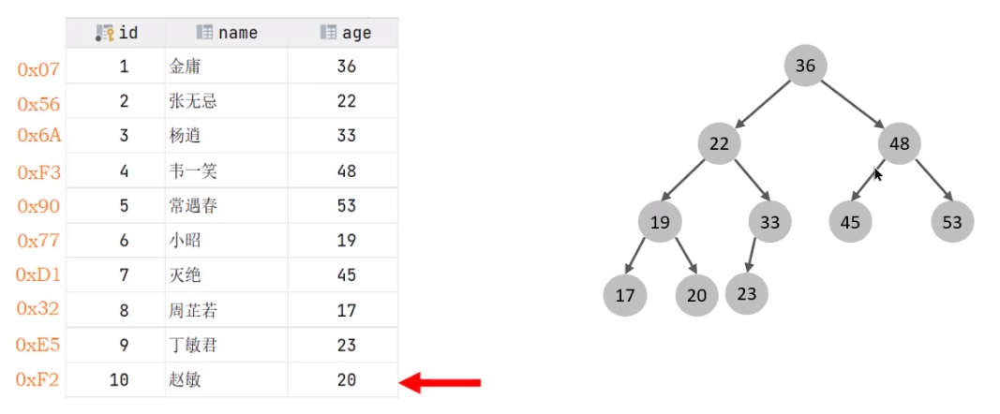
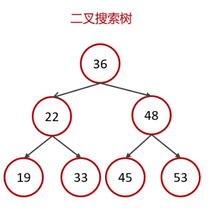
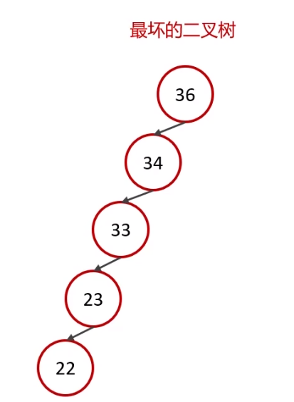
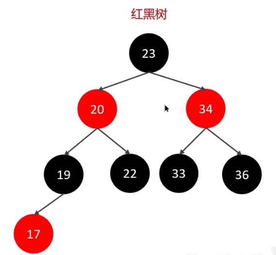
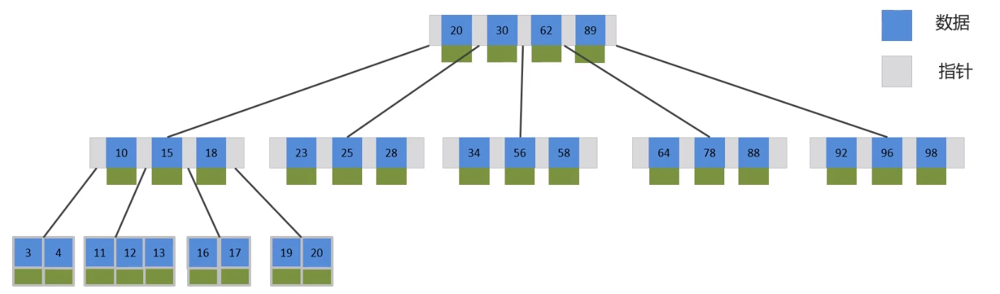
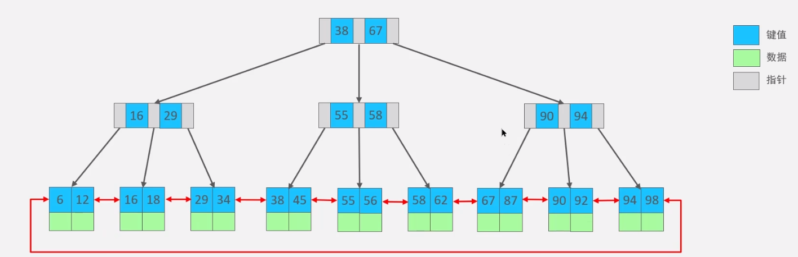

面试官可能会问道的问题：

**索引（index）** 是帮助 MySQL 高效获取数据的数据结构（有序）。在数据之外，数据库系统还维护着满足特定查询算法的数据结构（B+树），这些数据结构以某种方式引用（指向）数据，这样就可以在这些数据结构上实现高级查找算法，这种数据结构就是索引。

MySQL 索引使用的是 **B+树**，而不是二叉树。

## 数据结构对比
MySQL 默认使用的索引底层数据结构是 B+树。再聊 B+树之前，我们先聊聊**二叉树**和 **B 树**。

### 二叉树
 

二叉树会出现右边的最坏情况，所以 MySQL 没有使用二叉树。

红黑树存在的问题是每个节点都只能有两个子节点，当数量太大时，红黑树就会出现高度太高的情况，从而影响查询性能。

### B-Tree
B-Tree，B 树是一种多叉路衡查找树，相对于二叉树，B 树每个节点可以有多个分支 ，即多叉。

以一颗最大度数（max-degree）为 5（5 阶）的 b-tree 为例，那这个 B 树每个节点最多存储 4 个 key

### B+Tree
B+Tree 是在 BTree 基础上的一种优化，使其更适合实现外存储索引结构，InnoDB 存储引擎就是用 B+Tree 实现其索引结构

B 树与 B+树对比：

1. 磁盘读写代价 B+树更低；
2. 查询效率 B+树更加稳定；
3. B+树便于扫库和匹配查询；

### 面试场景
🗨️**了解过索引吗？（什么是索引）**

1. 索引（index）是帮助 MySQL 高效获取数据的数据结构（有序）
2. 提高数据检索的效率，降低数据库的 IO 成本（不需要全表扫描）
3. 通过索引列对数据进行排序，降低数据排序的成本，降低了 CPU 的消耗

🗨️**索引的底层数据结构了解过嘛？**

MySQL 的 InnoDB 引擎采用的 B+树的数据结构来存储索引

+ 阶数更多，路径更短
+ 磁盘读写代价 B+树更低，非叶子节点只存储指针，叶子节点存储数据
+ B+树便于扫库和区间查询，叶子节点是一个双向链表

:::success[面试场景]

**面试官:了解过索引吗?(什么是索引)**

候选人:嗯，索引在项目中还是比较常见的，它是帮助 MySQL 高效获取数据的数据结构，主要是用来提高数据检索的效率，降低数据库的 IO 成本，同时通过索引列对数据进行排序，降低数据排序的成本，也能降低了 CPU 的消耗

**面试官:索引的底层数据结构了解过嘛?**

候选人: MySQL 的默认的存储引擎 InnoDB 采用的 B+ 树的数据结构来存储索引，选择 B+ 树的主要的原因是:第一阶数更多，路径更短，第二个磁盘读写代价 B+ 树更低，非叶子节点只存储指针，叶子阶段存储数据，第三是 B+ 树便于扫库和区间查询，叶子节点是一个双向链表

**面试官: B 树和 B+ 树的区别是什么呢?**

候选人:第一: 在 B 树中，非叶子节点和叶子节点都会存放数据，而 B+ 树的所有的数据都会出现在叶子节点，在查询的时候，B+ 树查找效率更加稳定

第二:在进行范围查询的时候，B+ 树效率更高，因为 B+ 树都在叶子节点存储，并且叶子节点是一个双向链表

:::

