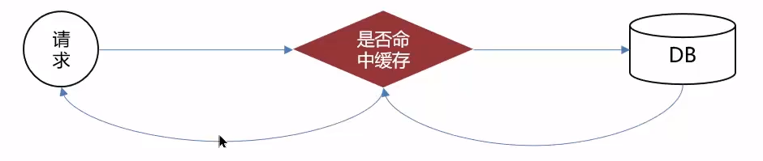
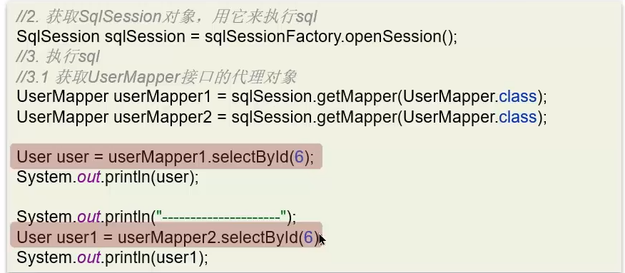
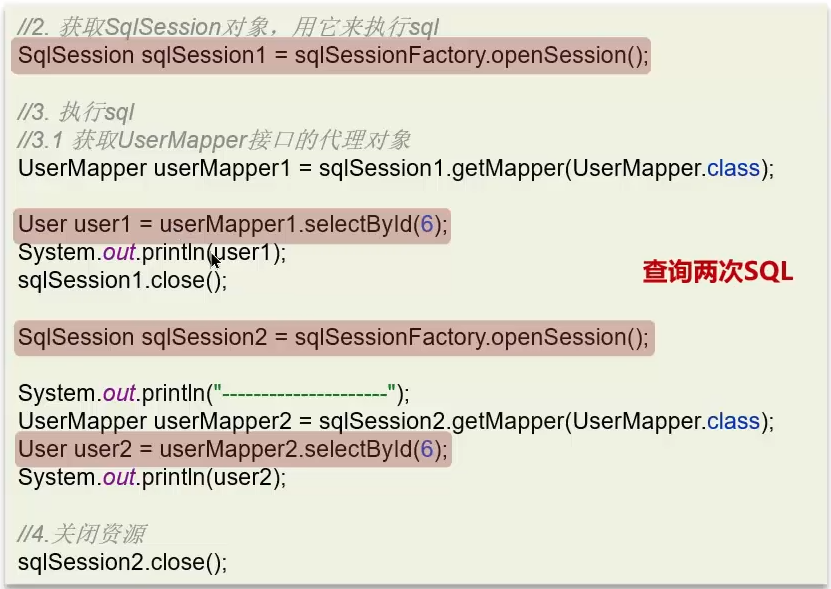
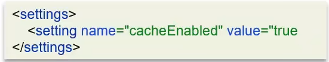

**🗨️** **MyBatis 的一级、二级缓存用过吗？**

+ 本地缓存，基于 PerpetualCache，本质是一个 HashMap
+ 一级缓存：作用域是 session 级别
+ 二级缓存：作用域是 namespace 和 mapper 的作用域，不依赖于 session

### 一级缓存
一级缓存:基于 PerpetualCache 的 HashMap 本地缓存，其存储作用域为 Session，当 Session 进行 flush 或 close 之后，该 Session 中的所有 Cache 就将清空，默认打并—级缓存。

### 二级缓存
二级缓存是基于namespace和mapper的作用域起作用的，不是依赖于SQL session，默认也是采用PerpetualCache,HashMap存储

**二级缓存默认是关闭的**

**开启方法，两步：**

1. 全局配置文件

2. 映射文件
    1. 使用<cache/>标签让当前 mapper 生效二级缓存

**注意事项:**

1. 对于缓存数据更新机制，当某一个作用域(一级缓存Session/二级缓存Namespaces)的进行了新增、修改、删除操作后，默认该作用域下所有select中的缓存将被clear
2. 二级缓存需要缓存的数据实现Serializable接口
3. 只有会话提交或者关闭以后，一级缓存中的数据才会转移到二级缓存中

### 面试场景
**🗨️** **MyBatis 的一级、二级缓存用过吗？**

+ 一级缓存:基于 PerpetualCache 的 HashMap 本地缓存，其存储作用域为 Session，当 Session 进行 flush 或 close 之后，该 Session 中的所有 Cache 就将清空，默认打开━级缓存
+ 二级缓存是基于 namespace 和 mapper 的作用域起作用的，不是依赖于 SQL session，默认也是采用 PerpetualCache，HashMap 存储。需要单独开启，一个是核心配置，一个是 mapper 映射文件

**🗨️** **MyBatis 的二级缓存什么时候会清理缓存中的数据？**

当某一个作用域(一级缓存 Session/二级缓存 Namespaces)的进行了新增、修改、删除操作后，默认该作用域下所有 select 中的缓存将被 clear。

### 二级缓存分布式问题

可以看看这个链接 https://www.cnblogs.com/isdxh/p/13963636.html  ，这里介绍了使用 redis 实现二级缓存，从而解决分布式无法删除缓存导致数据污染的问题。