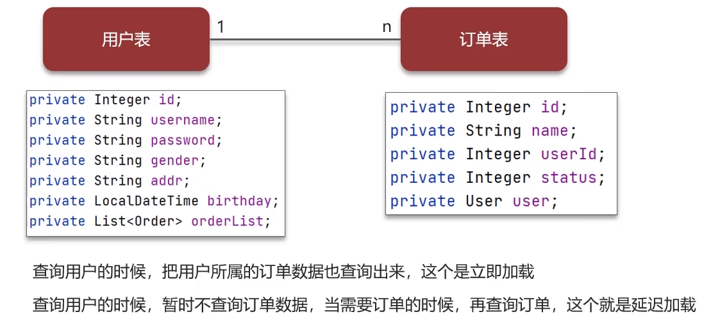
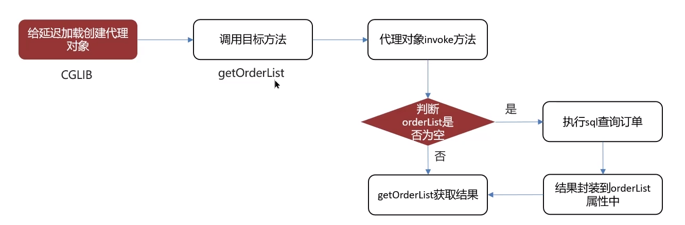

**🗨️** **MyBatis 是否支持延迟加载？**

MyBatis 支持延迟加载，但默认没有开启

**🗨️** **什么叫做延迟加载？**

### 延迟加载的原理
1. 使用 CGLIB 创建目标对象的代理对象
2. 当调用目标方法 user.getOrderList()时，进入拦截器 invoke 方法，发现 user.getOrderList()是 null 值，执行 sql 查询 order 列表
3. 把 order 查询上来，然后调用 user.setOrderList（List\<Order\> orderList），接着完成 user.getOrderList()方法的调用

### 面试场景
**🗨️** **MyBatis 是否支持延迟加载？**

+ 延迟加载的意思是：就是在需要用到数据时才进行加载，不需要用到数据时就不加载数据。
+ MyBatis 支持一对一关联对象和一对多关联集合对象的延迟
+ 在 MyBatis 配置文件中，可以配置是否启用延迟加载 lazyLoadingEnabled=true|false，默认是关闭的

**🗨️** **延迟加载的底层原理知道吗？**

1. 使用 CGLIB 创建目标对象的代理对象
2. 当调用目标方法时，进入拦截器 invoke 方法，发现目标方法是 null 值，执行 sql 查询
3. 获取数据以后，调用 set 方法设置属性值，再继续查询目标方法，就有值了

