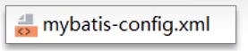
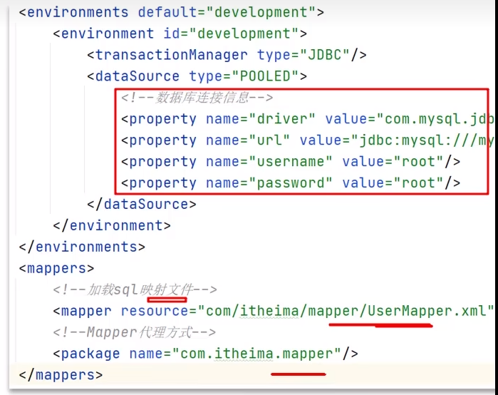
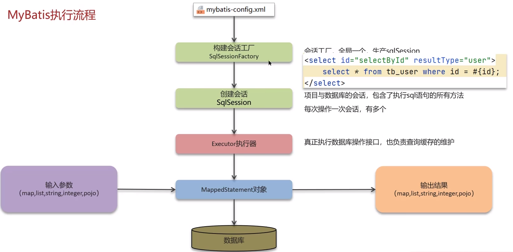

**🗨️** **MyBatis 执行流程**

+ 理解了各个组件的关系
+ Sql 的执行过程（参数映射、sql 解析、执行和结果处理）

### MyBatis 执行流程
首先使用 XML 配置 mysql 的连接方式

### 面试场景
**🗨️** **MyBatis 执行流程**

1. 读取 MyBatis 配置文件：mybatis-config.xml 加载运行环境和映射文件
2. 构建会话工厂 SqlSessionFactory
3. 会话工厂创建 SqlSession 对象（包含了执行 SQL 语句的所有方法）
4. 操作数据库的接口，Executor 执行器，同时负责查询缓存的维护
5. Executor 接口的执行方法中有一个 MappedStatement 类型的参数，封装了映射信息
6. 输入参数的映射（将 java 的类型转换为数据库支持的类型）
7. 输出结果映射（从数据库的类型转换为 java 类型）

