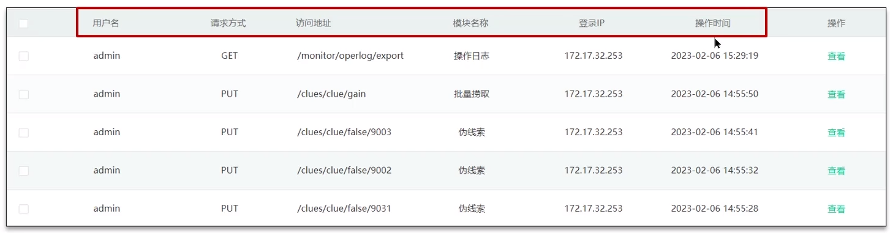
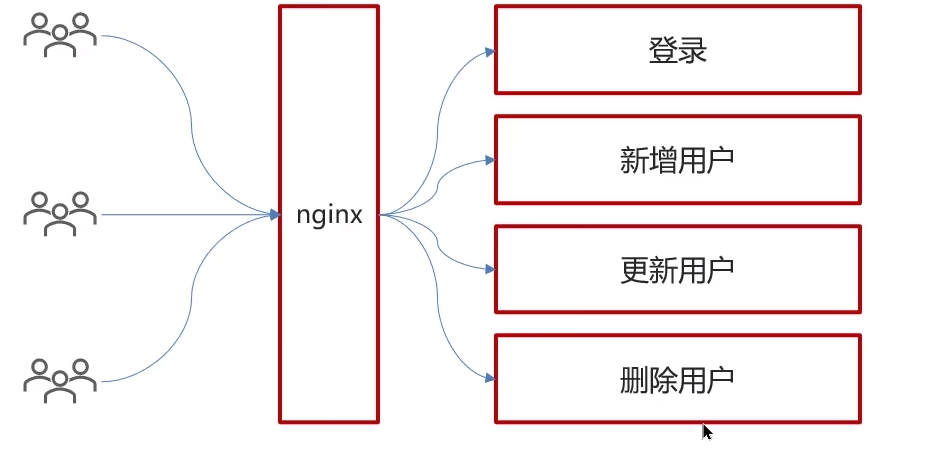
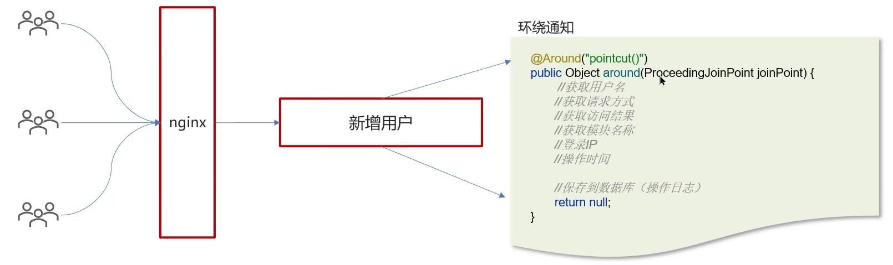
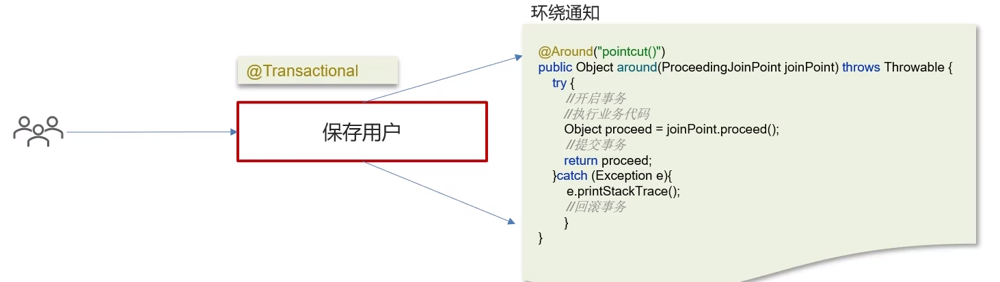

**🗨️** **什么是 AOP，你们项目中有没有使用到 AOP？**

+ 对 AOP 的理解
+ 有没有真的用过 AOP

AOP 称为面向切面编程，用于将那些与业务无关，但却对多个对象产生影响的公共行为和逻辑，抽取并封装为一个可重用的模块，这个模块被命名为“切面”（Aspect），减少系统中的重复代码，降低了模块间的耦合度，同时提高了系统的可维护性。

**常见的 AOP 使用场景：**

    - 记录操作日志
    - 缓存处理
    - Spring 中内置的事务处理

### 记录操作日志
记录操作日志思路：

获取请求的用户名、请求方式、访问地址、模块名称、登录 ip、操作时间、记录到数据库的日志表中

AOP 核心思想就是将通用代码抽出来，不要跟业务代码进行耦合

### Spring 中的事务实现
Spring 支持编程式事务管理和声明式事务管理两种方式。

+ 编程式事务控制：需使用 TransactionTemplate 来进行实现，对业务代码有侵入性，项目中很少使用
+ 声明式事务管理：声明式事务管理建立在 AOP 之上的。其本质是通过 AOP 功能，对方法前后进行拦截，将事务处理的功能编织到拦截的方法中，也就是在目标方法开始之前加入一个事务，在执行完目标方法之后根据执行情况提交或者回滚事务。

### 面试场景
**🗨️** **什么是 AOP？**

面向切面编程，用于将那些与业务无关，但却对多个对象产生影响的公共行为和逻辑，抽取公共模块复用，降低耦合

**🗨️** **你们项目中有没有使用到 AOP？**

记录操作日志，缓存，spring 实现的事务

核心是：使用 aop 中的环绕通知+切点表达式（找到要记录日志的方法），通过环绕通知的参数获取请求方法的参数（类、方法、注解、请求方法等），获取到这些参数以后，保存到数据库

**🗨️** **Spring 中的事务是如何实现的？**

其本质是通过 AOP 功能，对方法前后进行拦截，在执行方法之前开启事务，在执行完目标方法之后根据执行情况提交或者回滚事务。

