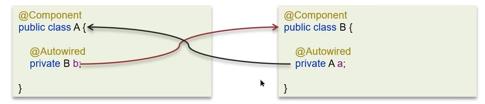

**🗨️** **Spring 中的循环引用？**

在创建 A 对象的同时需要使用到 B 对象，在创建 B 对象的同时需要使用到 A 对象

### 什么是 Spring 的循环依赖？

### 三级缓存解决循环依赖
Spring 解决循环依赖是通过三级缓存，对应的三级缓存如下所示：

### 一级缓存
一级缓存作用：限制 bean 在 beanFactory 中只存一份，即实现 singleton scope，解决不了循环依赖

对于上述的情况，一级缓存目前是没有对象可以存在单例池的，A 目前是等待 B，B 目前是等待 A。

### 使用一级缓存和二级缓存解决循环依赖问题
如果要想打破循环依赖，就需要一个中间人的参与，这个中间人就是二级缓存。

一级缓存和二级缓存能解决一般对象的循环依赖，如果一个对象是一个代理对象，这个时候使用上述的方法就行不通了。

这个时候就需要借助三级缓存了。

### 三级缓存解决循环依赖流程

Spring 框架可以通过三级缓存解决大部分的循环依赖问题，但是有些循环引用 Spring 框架解决不了，需要我们手动进行解决。

**比如：**

### 构造方法出现了循环依赖怎么解决？
三级缓存只能够解决 bean 初始化产生的循环依赖，但并不能解决构造函数产生的循环依赖。

@Lazy的作用是：什么时候需要 b 对象的时候才进行创建，起到延迟创建的功能。

### 面试场景
**🗨️** **Spring 中的循环引用？**

+ 循环依赖：循环依赖其实就是循环引用，也就是两个或两个以上的 bean 互相持有对方，最终形成闭环。比如 A 依赖于 B，B 依赖于 A
+ 循环依赖在 Spring 中是允许存在，Spring 框架依据三级缓存已经解决了大部分的循环依赖（即 set 方法注入的依赖）
    - **一级缓存：** 单例池，缓存已经经历了完整的生命周期，已经初始化完成的 bean 对象
    - **二级缓存：** 缓存早期的 bean 对象（生命周期还没有走完）
    - **三级缓存：** 缓存的是 ObjectFactory，表示对象工厂，用来创建某个对象的

**🗨️** **构造方法出现了循环依赖怎么解决？**

A 依赖于 B，B 依赖于 A，注入的方式是构造函数

**原因：** 由于 bean 的生命周期中构造函数是第一个执行的，spring 框架并不能解决构造函数的依赖注入

**解决方案：** 使用@Lazy 进行懒加载，什么时候需要对象再进行 bean 对象的创建

