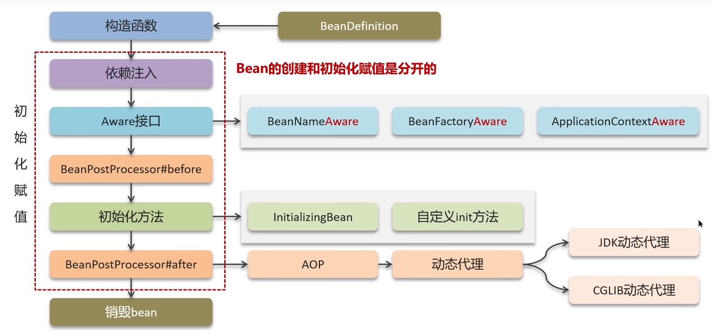
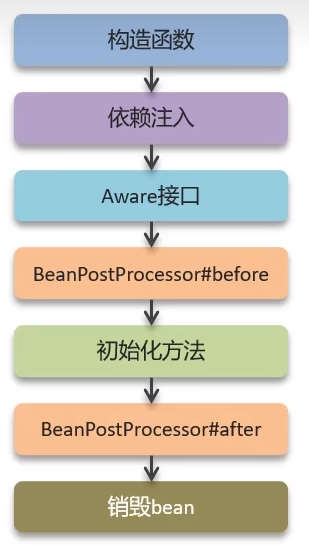

**🗨️** **Spring 的 bean 的生命周期？**

了解 bean 的生命周期可以更好的掌握：Spring 容器是如何管理和创建 bean 实例、方便调试和解决问题

### BeanDefinition
Spring 容器在进行实例化时，会将 xml 配置的 \<bean\> 的信息封装成一个 BeanDefinition 对象，Spring 根据 BeanDefinition 来创建 Bean 对象，里面有很多的属性用来描述 Bean。

+ beanClassName：bean 的类名
+ initMethodName：初始化方法名称
+ properryValues：bean 的属性值
+ scope：作用域
+ lazyInit：延迟初始化

### bean 的生命周期
### 面试场景
**🗨️** **Spring 的 bean 的生命周期？**

1. 通过 BeanDefinition 获取 bean 的定义信息
2. 调用构造函数实例化 bean
3. bean 的依赖注入
4. 处理 Aware 接口（BeanNameAware、BeanFactoryAware、ApplicationContextAware）
5. Bean 的后置处理器 BeanPostProcessor-前置
6. 初始化方法（InitializingBean、init-method）
7. Bean 的后置处理器 BeanPostProcessor-后置
8. 销毁 bean

