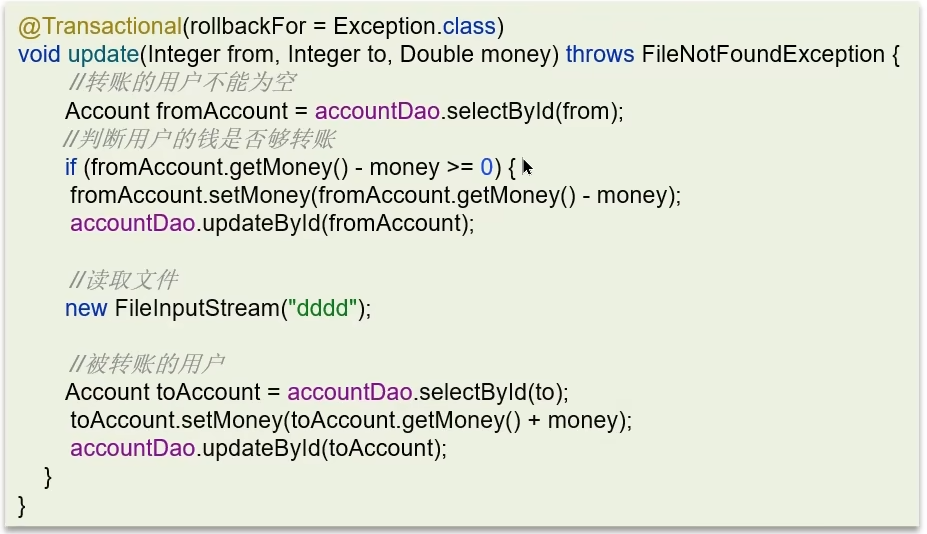

**🗨️** **Spring 中事务失效的场景有哪些？**

对 spring 框架的深入理解、复杂业务的编码经验

**三种常见的事务失效场景：**

    - 异常获取处理
    - 抛出检查异常
    - 非 public 方法


### 情况一：异常捕获处理


**原因：**

事务通知只有捉到了目标抛出的异常，才能进行后续的回滚处理，如果目标自己处理掉异常，事务通知无法知悉

**解决：**

在 catch 块添加 throw new RuntimeException(e) 抛出

### 情况二：抛出检查异常


**原因：**

Spring 默认只会回滚非检查异常（Runtime 异常）

**解决：**

配置 rollbackFor 属性

```java
@Transactional(rollbackFor=Exception.class)
```

### 情况三：非 public 方法导致的事务失效


**原因：**

Spring 为方法创建代理、添加事务通知、前提条件都是该方法是 public 的

**解决：**

改为 public 方法


### 面试场景
**🗨️** **Spring 中事务失效的场景有哪些？**

1. **异常捕获处理**，自己处理了异常，没有抛出，解决：手动抛出
2. **抛出检查异常**，配置 rollbackFor 属性为 Exception
3. **非 public 方法**导致的事务失效，改为 public