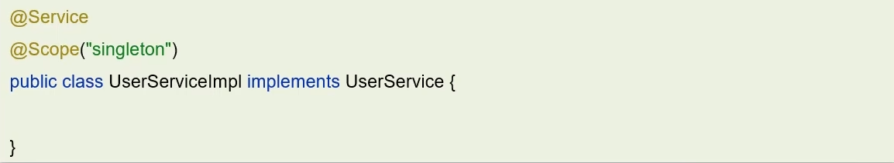
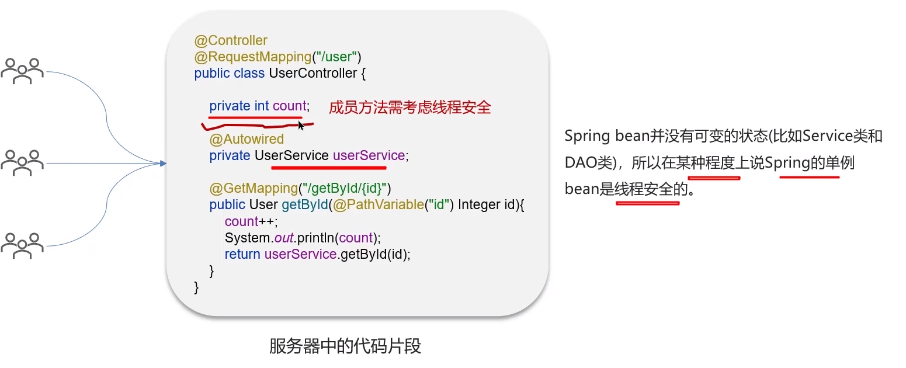

**🗨️** **Spring 框架中的单例 bean 是线程安全的吗？**

**🗨️** **Spring 框架中的 bean 是单例的吗？**

+ singleton：bean 在每个 Spring IOC 容器中只有一个实例。
+ prototype：一个 bean 的定义可以有多个实例。

**bean 不是线程安全的**

### 面试场景
**🗨️** **Spring 框架中的单例 bean 是线程安全的吗？**

不是线程安全的

Spring 框架中有一个@Scope注解，默认的值就是 singleton，单例的。

因为一般在 spring 的 bean 中都是注入无状态的对象，没有线程安全问题，如果在 bean 中定义了可修改的成员变量，是要考虑线程安全问题的，可以使用多例或者加锁来解决。

:::success[面试场景]

**面试官:Spring框架中的单例bean是线程安全的吗?**

**候选人:**

嗯!

不是线程安全的，是这样的

当多用户同时请求一个服务时，容器会给每一个请求分配一个线程，这是多个线程会并发执行该请求对应的业务逻辑（成员方法），如果该处理逻辑中有对该单列状态的修改（体现为该单例的成员属性），则必须考虑线程同步问题。

Spring框架并没有对单例bean进行任何多线程的封装处理。关于单例bean的线程安全和并发问题需要开发者自行去搞定。

比如:我们通常在项目中使用的Spring bean都是不可可变的状态(比如Service类和DAO类)，所以在某种程度上说Spring的单例bean是线程安全的。

如果你的bean有多种状态的话（比如View Model对象），就需要自行保证线程安全。最浅显的解决办法就是将多态bean的作用由“singleton"变更为"prototype”。

:::

