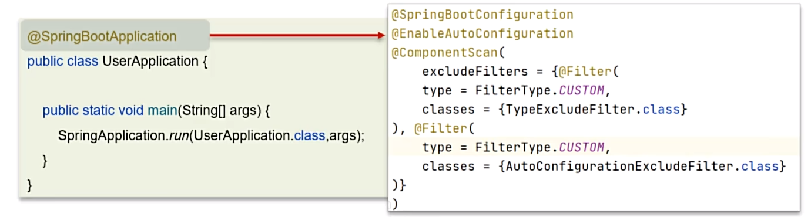
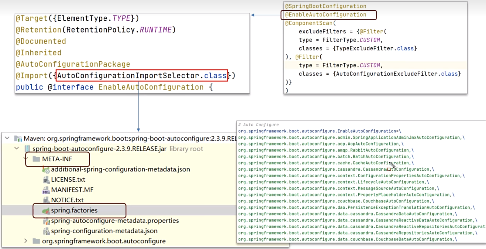
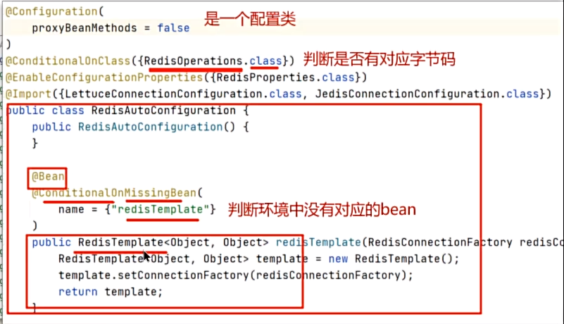

**🗨️** **Springboot 自动配置原理**

Springboot 中最高频的一道面试题，也是框架最核心的思想

+ @SpringBootConfiguration：该注解与@Configuration 注解作用相同，用来声明当前也是一个配置类
+ @ComponentScan：组件扫描，默认扫描当前引导类所在包及其子包
+ @EnableAutoConfiguration：SpringBoot 实现自动化配置的核心注解

### @EnableAutoConfiguration

### 面试场景
**🗨️** **Springboot 自动配置原理**

1. 在 SpringBoot 项目中的引导类上有一个注解@SpringBootApplication，这个注解是对三个注解进行了封装，分别是：
+ @SpringBootConfiguration
+ @EnableAutoConfiguration
+ @ComponentScan
2. 其中 @EnableAutoConfiguration 是实现自动化配置的核心注解。该注解通过@Import 注解导入对应的配置选择器。

内部就是读取了该项目和该项目引用的 Jar 包的 classpath 路径下 META-INF/spring.factories 文件中的所配置的类的全类名。在这些配置类中所定义的 Bean 会根据条件注解所指定的条件来决定是否需要将其导入到 Spring 容器中。

3. 条件判断会有像 @ConditionalOnClass 这样的注解，判断是否有对应的 class 文件，如果有则加载该类，把这个配置类的所有的 Bean 放入 spring 容器中使用

