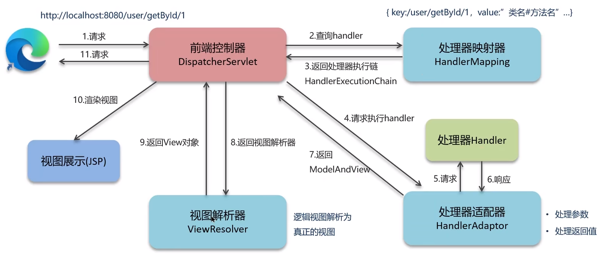
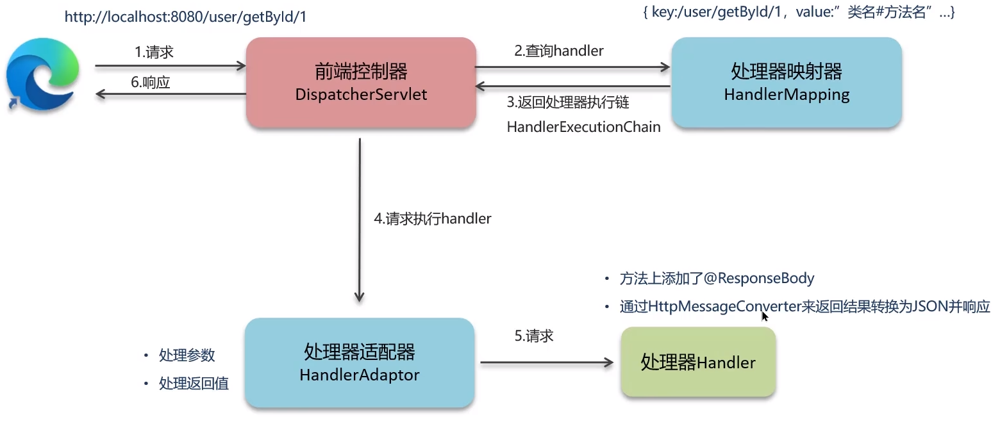

**🗨️** **SpringMVC 的执行流程知道嘛**

Springmvc 的执行流程是这个框架最核心的内容

    - 视图阶段（老旧 JSP 等）
    - 前后端分离阶段（接口开发，异步）

### 视图阶段（JSP）
### 前后端分离阶段（接口开发，异步请求）

**🗨️** **SpringMVC 的执行流程知道嘛**

1. 用户发送出请求到前端控制器 DispatcherServlet
2. DispatcherServlet 收到请求调用 HandlerMapping（处理器映射器）
3. HandlerMapping 找到具体的处理器，生成处理器对象以及处理器拦截器（如果有），再一起返回给 DispatcherServlet。
4. DispatcherServlet 调用 HandlerAdapter（处理器适配器）
5. HandlerAdapter 经过适配调用具体的处理器（Handler/Controller）
6. Controller 执行完成返回 ModelAndView 对象
7. HandlerAdapter 将 Controller 执行结果 ModelAndView 返回给 DispatcherServlet
8. DIspatcherServlet 将 ModelAndView 传给 ViewReslover（视图解析器）
9. ViewReslover 解析后返回具体 View（视图）
10. DispatcherServlet 根据 View 进行渲染视图（即将模型数据填充至视图中）
11. DispatcherServlet 响应用户

**🗨️** **SpringMVC 的执行流程知道嘛（版本 2：前后端开发，接口开发）**

1. 用户发送出请求到前端控制器 DispatcherServlet
2. DispatcherServlet 收到请求调用 HandlerMapping（处理器映射器）
3. HandlerMapping 找到具体的处理器，生成处理器对象以及处理器拦截器（如果有），再一起返回给 DispatcherServlet。
4. DispatcherServlet 调用 HandlerAdapter（处理器适配器）
5. HandlerAdapter 经过适配调用具体的处理器（Handler/Controller）
6. 方法上添加了@ResponseBody
7. 通过 HttpMessageConverter 来将结果转换为 JSON 并响应
