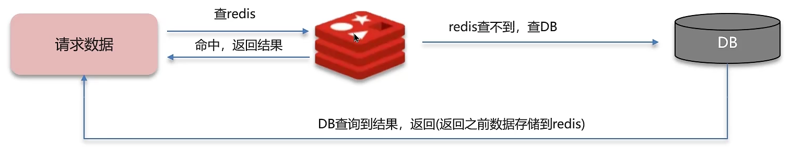
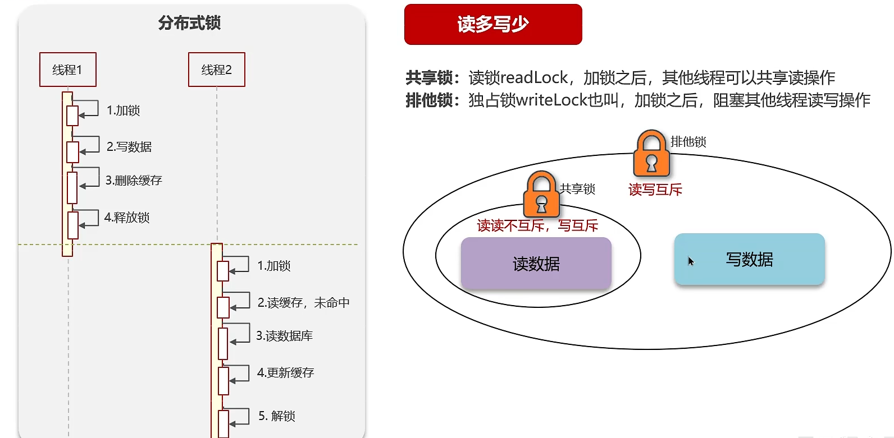
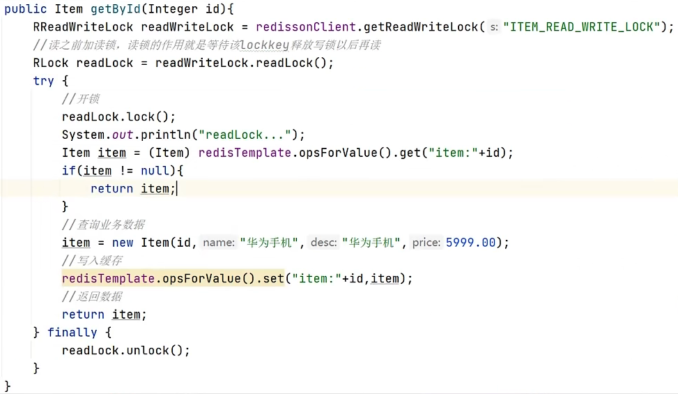
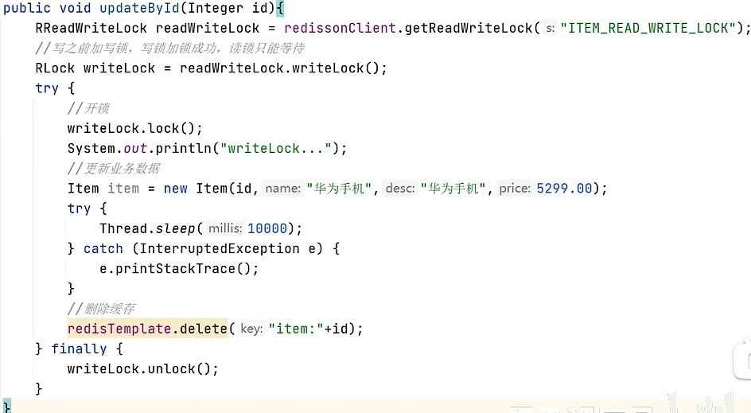
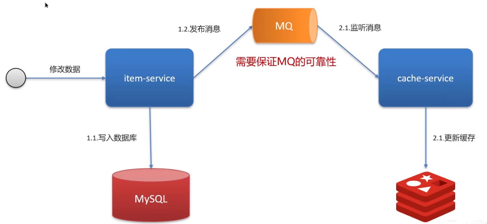
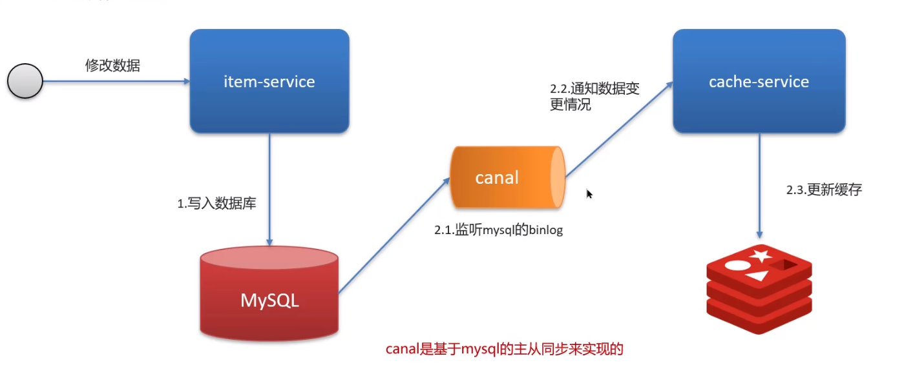

双写一致性：当修改了数据库的数据也要同时更新缓存的数据，缓存和数据库的数据要保持一致。

+ 读操作：缓存命中，直接返回；缓存未命中，查询数据库，写入缓存，设定超时时间。
+ 写操作：延迟双删（弱一致性）

    

  - 先删除缓存，还是先修改数据库？（这两种情况在多线程下都可能导致redis中的数据与数据库不一致）(见下文分析)
  - 为什么要删除两次缓存？
  - 为什么要延时删除？（因为一般的redis都是主从模式的，我们需要延时一会儿，让主节点把数据同步到从节点）

让我们再来看看孤独烟老师《分布式之数据库和缓存双写一致性方案解析》：
先删缓存，再更新数据库，该方案会导致请求数据不一致
> 同时有一个请求A进行更新操作，另一个请求B进行查询操作。那么会出现如下情形:
> 1) 请求A进行写操作，删除缓存
> 2) 请求B查询发现缓存不存在
> 3) 请求B去数据库查询得到旧值
> 4) 请求B将旧值写入缓存
> 5) 请求A将新值写入数据库

先更新数据库，再删缓存这种情况不存在并发问题么？

> 不是的。假设这会有两个请求，一个请求A做查询操作，一个请求B做更新操作，那么会有如下情形产生
> 1) 缓存刚好失效
> 2) 请求A查询数据库，得一个旧值
> 3) 请求B将新值写入数据库
> 4) 请求B删除缓存
> 5) 请求A将查到的旧值写入缓存

+ 写操作：分布式锁（强一致性）。可以通过加一个分布式锁来解决该问题（左下图），因为我们操作数据一般都是读多写少，通过优化（左下图），当读数据时添加共享锁，当写数据时添加排他锁，这样可以大大提高读写性能。

代码实现：

读操作

写操作：

虽然使用了读写锁可以保证 redis 和 mysql 中数据的强一致性，但会导致性能较低（因为写数据的时候依然会阻塞其他线程读数据）。

**允许短暂的不一致，但最终一致**

+ 异步通知保证数据的最终一致性（可以允许短暂的不一致，但最终还是一致的），基于 MQ。

    

+ 基于Canal的异步通知：
    

> 二进制日志（BINLOG）记录了所有的 DDL（数据定义语言）语句和 DML（数据操纵语言）语句，但不包括数据查询（SELECT、SHOW）语句。

## 面试场景

**面试官:** redis 做为缓存，mysql 的数据如何与 redis 进行同步呢?（双写一致性)

**候选人:** 嗯! 就说我最近做的这个项目，里面有 xxx (根据自己的简历上写）的功能，需要让数据库与redis高度保持一致，因为要求时效性比较高，我们当时采用的读写锁保证的强一致性。

我们采用的是 redisson 实现的读写锁，在读的时候添加共享锁，可以保证读读不互斥，读写互斥。当我们更新数据的时候，添加排他锁，它是读写，读读都互斥，这样就能保证在写数据的同时是不会让其他线程读数据的，避免了脏数据。这里面需要注意的是读方法和写方法上需要使用同一把锁才行。

**面试官:** 那这个排他锁是如何保证读写、读读互斥的呢?

**候选人:** 其实排他锁底层使用也是setnx，保证了同时只能有一个线程操作锁住的方法

**面试官:** 你听说过延时双删吗?为什么不用它呢?

**候选人:** 延迟双删，如果是写操作，我们先把缓存中的数据删除，然后更新数据库，最后再延时删除缓存中的数据，其中这个延时多久不太好确定，在延时的过程中可能会出现脏数据，并不能保证强一致性，所以没有采用它。

**面试官:** redis做为缓存，mysql的数据如何与redis进行同步呢?(双写一致性)

**候选人:** 嗯!就说我最近做的这个项目，里面有xxxx(根据自己的简历上写）的功能，数据同步可以有一定的延时（符合大部分业务)

我们当时采用的阿里的canal组件实现数据同步:不需要更改业务代码，部署一个canal服务。canal服务把自己伪装成mysql的一个从节点，当mysql数据更新以后，canal会读取binlog数据，然后在通过canal的客户端获取到数据，更新缓存即可。