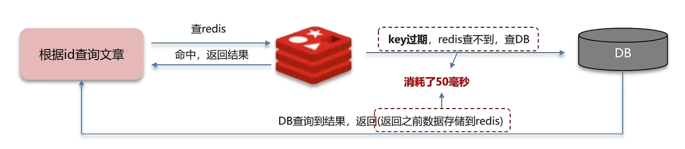
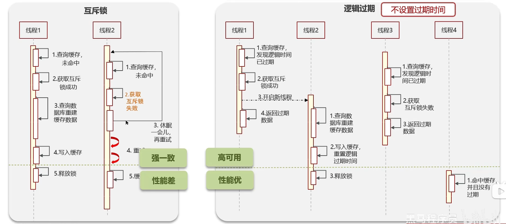

# 缓存击穿

**缓存击穿：** 给某一个 key 设置了过期时间，当 key 过期的时候，恰好这个时间点对这个 key 有大量的并发请求过来，这些并发的请求可能会瞬间把 DB 压垮

- **解决方案一：** 互斥锁，强一致性，性能差
- **解决方案二：** 逻辑过期，高可用，性能优，不能保证数据绝对一致

## 面试场景

> **面试官:** 什么是缓存击穿?怎么解决?  
>
> **候选人:**  
> 
> 嗯!!  
> 缓存击穿的意思是对于设置了过期时间的key，缓存在某个时间点过期的时候，恰好这时间点对这个Key有大量的并发请求过来，这些请求发现缓存过期一般都会从后端DB加载数据并回设到缓存，这个时候大并发的请求可能会瞬间把DB压垮。
>   
> 解决方案有两种方式:  
> - 第一可以使用互斥锁:当缓存失效时，不立即去load db，先使用如Redis的 setnx去设置一个互斥锁，当操作成功返回时再进行load db的操作并回设缓存，否则重试get缓存的方法  
> - 第二种方案可以设置当前key逻辑过期，大概是思路如下:  
>   - 在设置key的时候，设置一个过期时间字段一块存入缓存中，不给当前key设置过期时间
>   - 当查询的时候，从redis取出数据后判断时间是否过期
>   - 如果过期则开通另外一个线程进行数据同步，当前线程正常返回数据，这个数据不是最新  
> 
> 当然两种方案各有利弊:  
> - 如果选择数据的强一致性，建议使用分布式锁的方案，性能上可能没那么高，锁需要等，也有可能产生死锁的问题
> - 如果选择key的逻辑删除，则优先考虑的高可用性，性能比较高，但是数据同步这块做不到强一致。