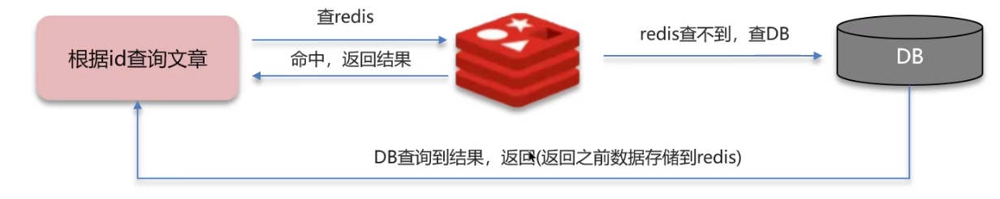
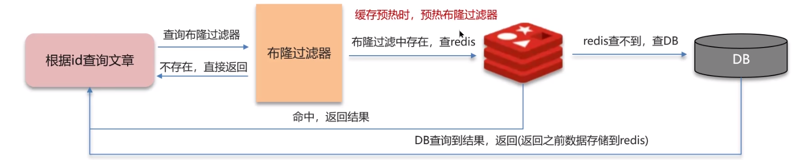
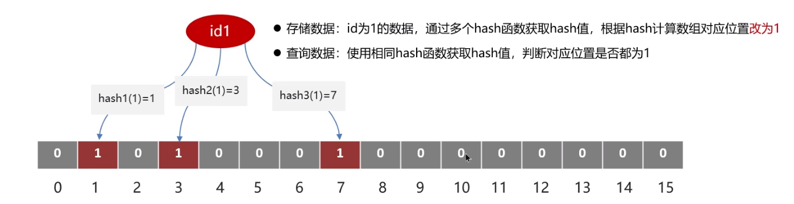
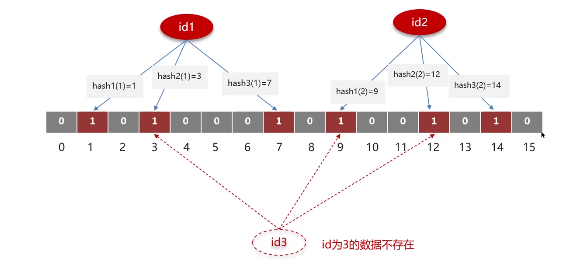

>例：
>一个 get 请求：api/news/getById/1

**缓存穿透：** 查询一个**不存在**的数据，mysql 查询不到数据也不会直接写入缓存，就会导致每次请求都查数据库

**解决方案一：** 缓存空数据，查询返回的数据为空，仍把这个空结果进行缓存。
**优点：** 简单
**缺点：** 消耗内存，可能会发生不一致的问题

**解决方案二：** 布隆过滤器

**优点：** 内存占用较少，没有多余 key
**缺点：** 实现复杂，存在误判

## 布隆过滤器
**bitmap（位图）：** 相当于是一个以（bit）位为单位的数组，数组中每个元素智能存储二进制数 0 或 1
**布隆过滤器作用：** 布隆过滤器可以用于检索一个元素是否在一个集合中。

但是可能出现误判现象，如下所示：

如何解决这个现象呢？我们可以降低误判率来减少误判的可能性。
**误判率：** 数组越小误判率就越大，数组越大误判率就越小，但是同时带来了更多的内存消耗。

## 面试场景
> **面试官:** 什么是缓存穿透?怎么解决?  
> **候选人:**  
> 嗯~~，我想一下  
> 缓存穿透是指查询一个一定不存在的数据，如果从存储层查不到数据则不写入缓存，这将导致这个不存在的数据每次请求都要到DB去查询，可能导致DB挂掉。这种情况大概率是遭到了攻击。  
>解决方案的话，我们通常都会用布隆过滤器来解决它

> **面试官:** 好的，你能介绍一下布隆过滤器吗?  
> **候选人:**  
> 嗯，是这样~  
> 布隆过滤器主要是用于检索一个元素是否在一个集合中。我们当时使用的是redisson实现的布隆过滤器。  
> 它的底层主要是先去初始化一个比较大数组，里面存放的二进制0或1。在一开始都是o，当一个key来了之后经过3次hash计算，模于数组长度找到数据的下标然后把数组中原来的o改为1，这样的话，三个数组的位置就能标明一个key的存在。查找的过程也是一样的。  
> 当然是有缺点的，布隆过滤器有可能会产生一定的误判，我们一般可以设置这个误判率，大概不会超过5%，其实这个误判是必然存在的，要不就得增加数组的长度，其实已经算是很划分了，5%以内的误判率一般的项目也能接受，不至于高并发下压倒数据库。