**redis分布式锁，是如何实现的？**

需要结合项目中的业务进行回答，通常情况下，分布式锁使用的场景:集群情况下的定时任务、抢单、幂等性场景。

抢券场景

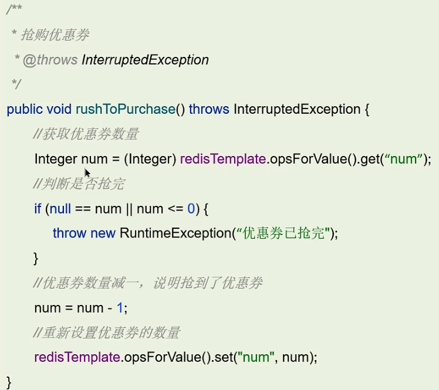

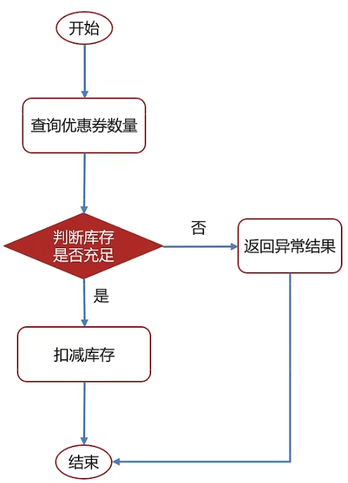

在集群的情况下，我们是不能使用本地的锁来解决，需要使用外部的锁来解决（即：分布式锁）。

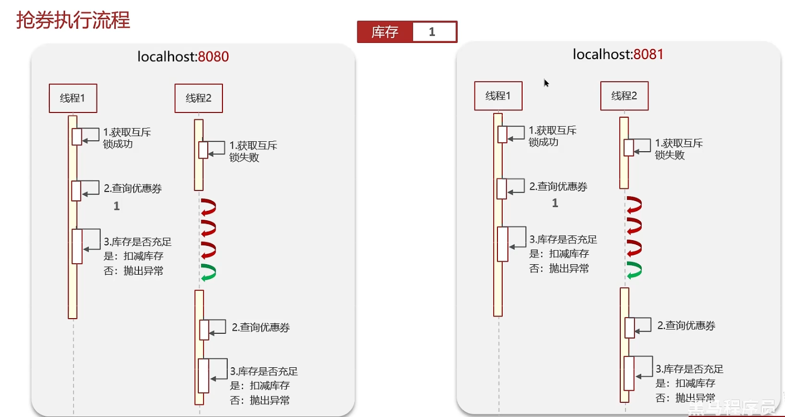

### 分布式锁处理过程
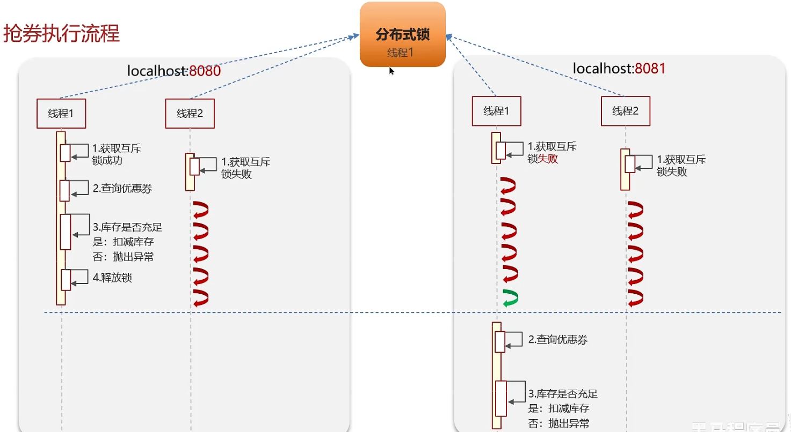

### redis分布式锁
Redis实现分布式锁主要利用Redis的setnx命令。setnx是SET if no exists（如果不存在，则 SET）的简写。

具体的使用方式如下：

+ **获取锁：**

+ **释放锁：**

获取锁的时候必须设置过期时间。假如没有设置过期时间，则会出现业务超时或服务宕机时，不会自动释放锁，那么这样就会导致其他线程无法获取该锁，导致**死锁**现象。

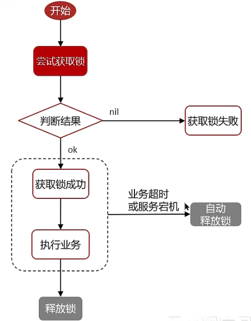

那么这个时候面试官可能会接着问：

:::tips
**Redis实现分布式锁如何合理的控制锁的有效时长？**

有两种方案，

1）根据业务执行时间预估，来设置锁的过期时间（不太靠谱，时间不好控制）

2）给锁续期，我们一开始设置锁的过期时间，再开另外一个线程用来监控，来判断业务到底执行了多久，如果说业务执行时间比较长，则增加当前获得锁的线程持有锁的时长。那么其实有现成的线程已经实现了该技术（即：看门狗）

:::

### redission实现的分布式锁-执行流程
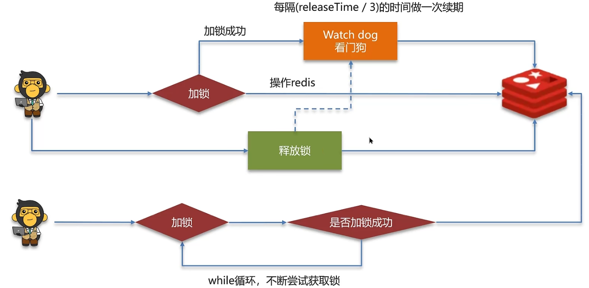

**redission使用的代码如下：**

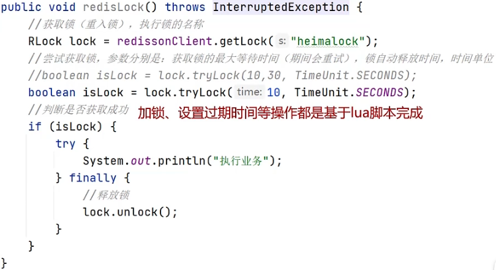

### redission实现的分布式锁-可重入
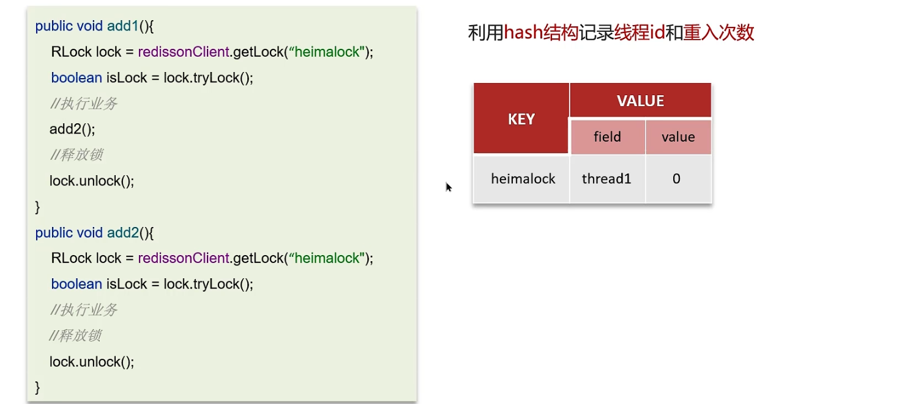

### redission实现的分布式锁-主从一致性
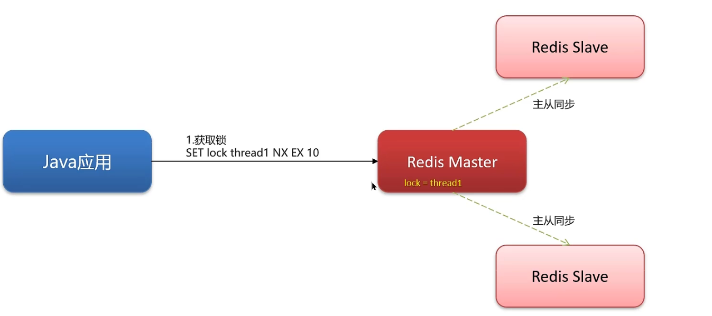

当Java应用通过分布式获取锁的时候，正常情况下，主节点需要把数据同步到从节点。但是，假如主节点还没来得及同步数据就宕机了，那么依据redis提供的哨兵模式，会在两个从节点中选出一个节点作为主节点。而当有新的线程请求来之后，会去尝试请求新的主节点来获取锁，而因为之前宕机的mater数据没有同步过来，导致新的线程也能够加锁成功，那么这个时候就会出现两个线程同时持有同一把锁的情况（可能出现脏数据的现象）。

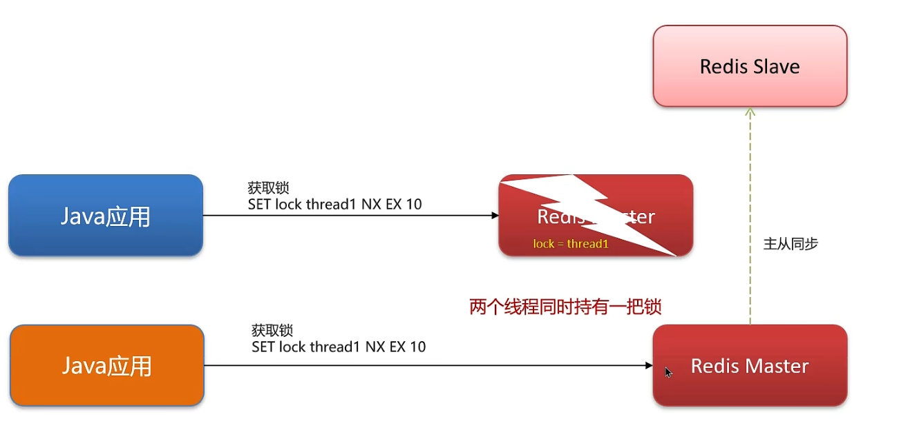

为了解决上述情况，redis提供了另外一个锁机制。 RedLock（红锁）：不能旨在一个redis实例上创建锁 ，应该是在多个redis实例上创建锁（n/2+1），避免在一个redis实例上加锁。

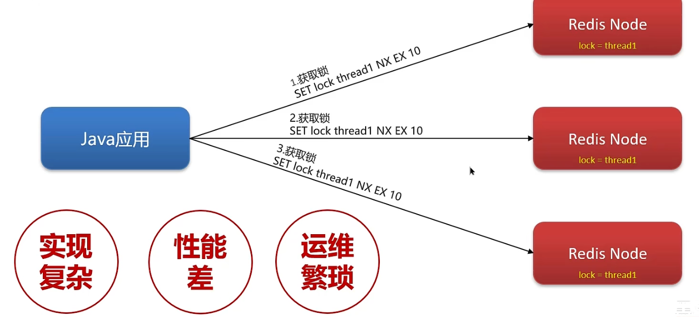

但是一般不建议使用RedLock。redis使用的是AP的思想，也就是最终保证一致性。而我们想要使用到强一致性，可以使用CP思想的zookeeper。

### 面试场景
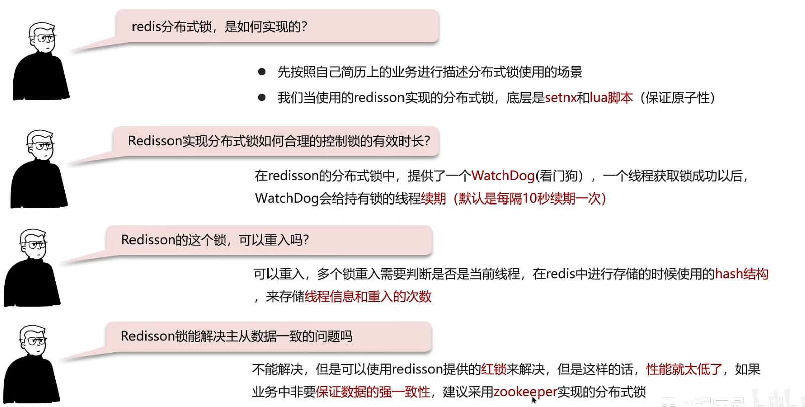

:::tips
**面试官:**Redis分布式锁如何实现?

**候选人:**嗯，在redis中提供了一个命令**setnx(SET if not exists)**

由于redis的单线程的，用了命令之后，只能有一个客户端对某一个key设置值，在没有过期或删除key的时候是其他客户端是不能设置这个key的

**面试官:**好的，那你如何控制Redis实现分布式锁有效时长呢?

**候选人:**嗯，的确，redis的setnx指令不好控制这个问题，我们当时采用的redis的一个框架redisson实现的。

在redisson中需要手动加锁，并且可以控制锁的失效时间和等待时间，当锁住的一个业务还没有执行完成的时候，在redisson中引入了一个**看门狗**机制，就是说每隔一段时间就检查当前业务是否还持有锁，如果持有就增加加锁的持有时间，当业务执行完成之后需要使用释放锁就可以了

还有一个好处就是，在高并发下，一个业务有可能会执行很快，先客户1持有锁的时候，客户2来了以后并不会马上拒绝，它会自选不断尝试获取锁，如果客户1释放之后，客户2就可以马上持有锁，性能也得到了提升。

**面试官:**好的，redisson实现的分布式锁是可重入的吗?

**候选人:**嗯，**是可以重入的**。这样做是为了避免死锁的产生。这个重入其实在内部就是判断是否是当前线程持有的锁，如果是当前线程持有的锁就会计数，如果释放锁就会在计算上减一。在存储数据的时候采用的hash结构，大key可以按照自己的业务进行定制，其中小key是当前线程的唯一标识，value是当前线程重入的次数

:::

