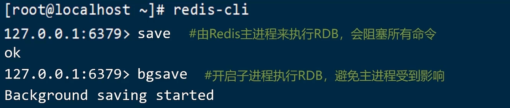
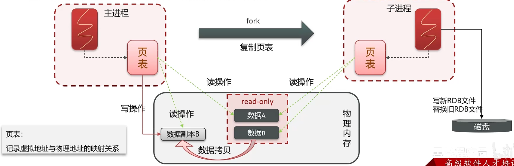
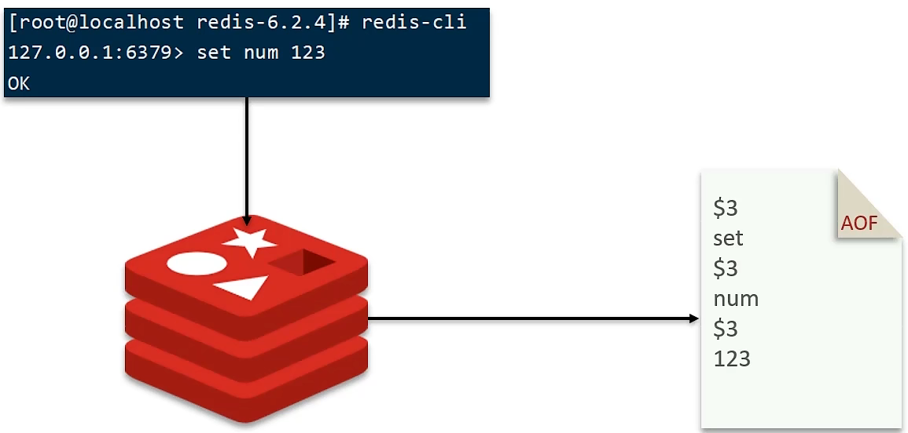
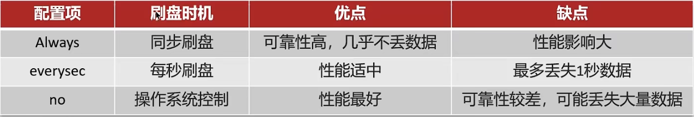
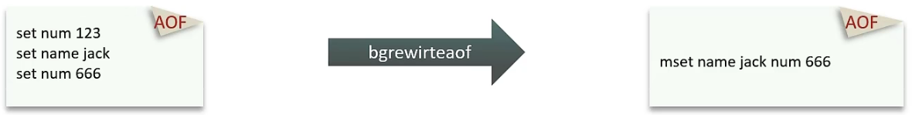
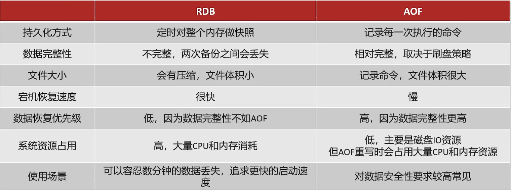

RDB 全称 Redis Database Backup file （Redis数据备份文件），也被叫做Redis数据快照。简单来说就是把内存中的所有数据都记录到磁盘中。当Redis实例故障重启后，从磁盘读取快照文件，恢复数据。



Redis 内部有触发 RDB 的机制，可以在 redis.conf 文件中找到，格式如下：


## <font style="color:rgb(255, 0, 1);">RDB的执行原理是什么？</font>
bgsave 开始时会 fork 主进程得到子进程，子进程<font style="color:rgb(255, 0, 1);">共享</font>主进程的内存数据。完成 fork 后读取内存数据并写入 RDB 文件。
fork 采用的是 copy-on-write 技术：
- 当主进程执行读操作时，访问共享内存；
- 当主进程执行写操作时，则会拷贝一份数据，执行写操作。



## <font style="color:rgb(243, 50, 50);">AOF</font>
AOF全称为Append Only File（追加文件）。Redis处理的每一个写命令都会记录在AOF文件，可以看做是命令日志文件。



AOF 默认是关闭的，需要修改 `redis.conf` 配置文件来开启 AOF：

```makefile
#是否开启AOF功能，默认是no
appendonly yes
#AOF文件的名称
appendfilename "appendonly.aof"
```

AOF 的命令记录的频率也可以通过 `redis.conf` 文件来配：

```makefile
#表示每执行一次写命令，立即记录到AOF文件
appendfsync always
#写命令执行完先放入AOF缓冲区，然后表示每隔1秒将缓冲区数据写到AOF文件，是默认方案
appendfsync everysec
#写命令执行完先放入AOF缓冲区，由操作系统决定何时将缓冲区内容写回磁盘
appendfsync no
```



因为是记录命令，AOF 文件会比 RDB 文件大的多。而且 AOF 会记录对同一个 key 的多次写操作，但只有最后一次写操作才有意义。通过执行<font style="color:rgb(255, 0, 1);"> bgrewriteaof </font>命令，可以让 AOF 文件执行重写功能，用最少的命令达到相同效果。



Redis也会在出发阈值时自动去重写 AOF 文件。阈值也可以在 `redis.conf` 中配置：

<font style="color:rgb(135, 193, 32);"># AOF 文件比上次文件 增长超过多少百分比则触发重写</font>
auto-aof-rewrite-percentage 100
<font style="color:rgb(135, 193, 32);">#AOF 文件体积最小多大以上才触发重写</font>
auto-aof-rewrite-min-size 64mb

## <font style="color:rgb(255, 0, 1);">RDB 与 AOF 对比</font>
<font style="color:rgb(0, 0, 0);">RDB 和 AOF 各有自己的优缺点，如果对数据安全性要求较高，在实际开发中往往会</font><font style="color:rgb(255, 0, 1);">结合</font>两者来使用。



## 面试场景
> **面试官:** redis 做为缓存，数据的持久化是怎么做的?
>
> **候选人:** 在 Redis 中提供了两种数据持久化的方式:1、RDB 2、AOF
> 
> **面试官:** 这两种持久化方式有什么区别呢?
>
> **候选人:** RDB 是一个快照文件，它是把 redis 内存存储的数据写到磁盘上，当 redis 实例宕机恢复数据的时候，方便从RDB的快照文件中恢复数据。
> 
> AOF 的含义是追加文件，当 redis 操作写命令的时候，都会存储这个文件中，当redis实例宕机恢复数据的时候，会从这个文件中再次执行一遍命令来恢复数据
> 
> **面试官:** 这两种方式，哪种恢复的比较快呢?
> 
> **候选人:** RDB 因为是二进制文件，在保存的时候体积也是比较小的，它恢复的比较快，但是它有可能会丢数据，我们通常在项目中也会使用 AOF 来恢复数据，虽然 AOF 恢复的速度慢一些，但是它丢数据的风险要小很多，在 AOF 文件中可以设置刷盘策略，我们当时设置的就是每秒批量写入一次命令
