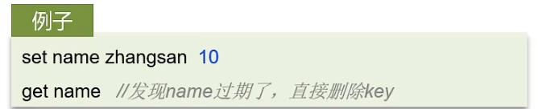

**假如redis的key过期之后，会立即删除吗？**

Redis对数据设置数据的有效时间，数据过期以后，就需要将数据从内存中删除掉。可以按照不同的规则进行删除，这种删除规则就被称之为数据的删除策略（数据过期策略）。 惰性删除、定期删除

### Redis数据删除策略-惰性删除
**惰性删除：**设置该key过期时间后，我们不去管它，当需要该key时，我们在检查其是否过期，如果过期，我们就删除它，反之返回该key。

**优点∶**对CPU友好，只会在使用该key时才会进行过期检查，对于很多用不到的key不用浪费时间进行过期检查

**缺点∶**对内存不友好，如果一个key已经过期，但是一直没有使用，那么该key就会一直存在内存中，内存永远不会释放

### Redis数据删除策略-定期删除
**定期删除：**每隔一段时间，我们就对一些key进行检查，删除里面过期的key(从一定数量的数据库中取出一定数量的随机key进行检查，并删除其中的过期key)。

定期清理有两种模式:

+ SLOW模式是定时任务，执行频率默认为10hz，每次不超过25ms，以通过修改配置文件redis.conf的hz选项来调整这个次数
+ FAST模式执行频率不固定，但两次间隔不低于2ms，每次耗时不超过1ms

**优点：**可以通过限制删除操作执行的时长和频率来减少删除操作对CPU的影响。另外定期删除，也能有效释放过期键占用的内存。

**缺点：**难以确定删除操作执行的时长和频率。

**Redis的过期删除策略****：惰性删除****+****定期删除****两种策略进行配合使用**

### 面试场景
:::tips
**面试官:**Redis的数据过期策略有哪些?

**候选人:**

嗯~，在redis中提供了两种数据过期删除策略

第一种是惰性删除，在设置该key过期时间后，我们不去管它，当需要该key时，我们在检查其是否过期，如果过期，我们就删掉它，反之返回该key 。

第二种是定期删除，就是说每隔一段时间，我们就对一些key进行检查，删除里面过期的key

定期清理的两种模式:

+ SLOW模式是定时任务，执行频率默认为10hz，每次不超过25ms，以通过修改配置文件redis.conf的**hz**选项来调整这个次数
+ FAST模式执行频率不固定，每次事件循环会尝试执行，但两次间隔不低于2ms，每次耗时不超过1ms

Redis的过期删除策略:**惰性删除＋定期删除**两种策略进行配合使用。
