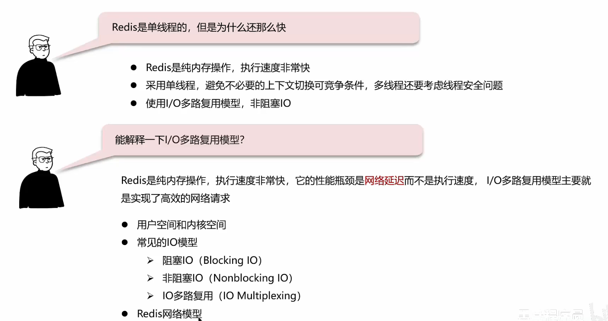
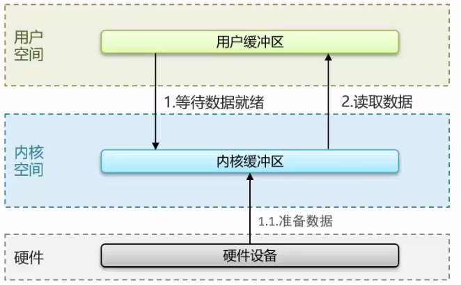
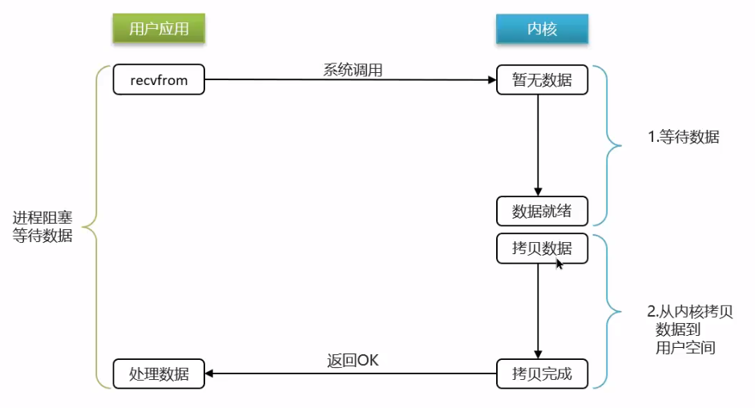
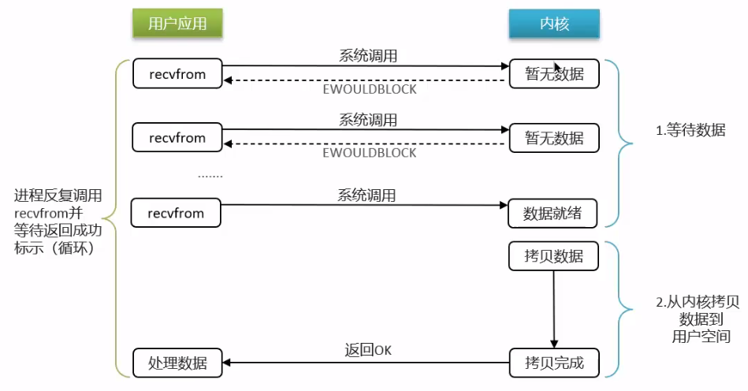
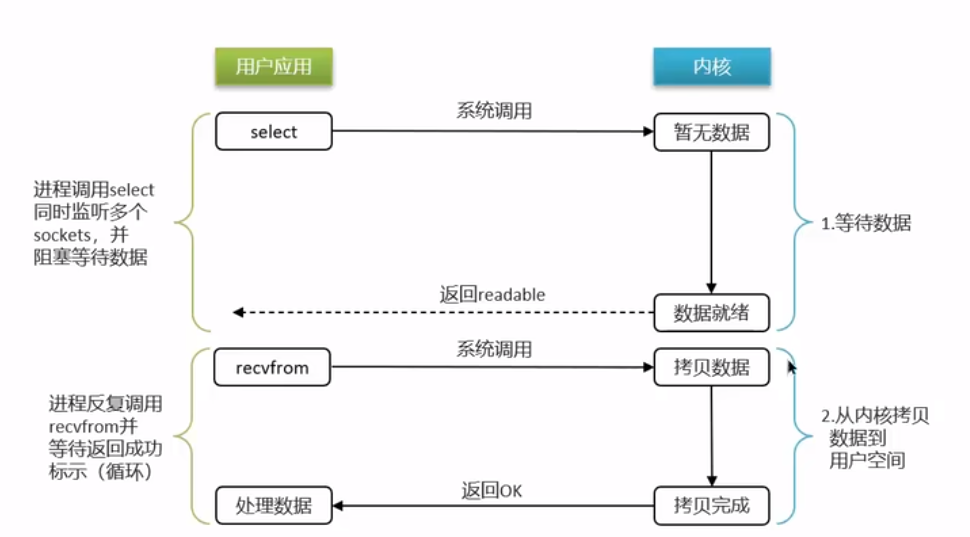
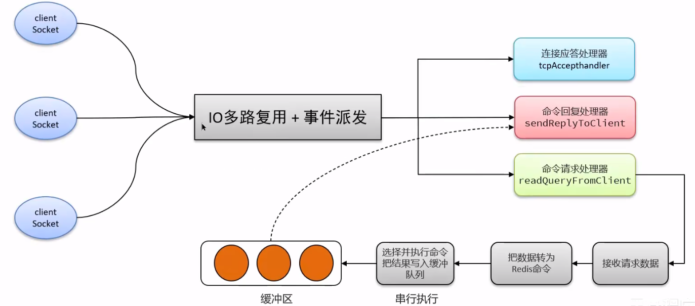
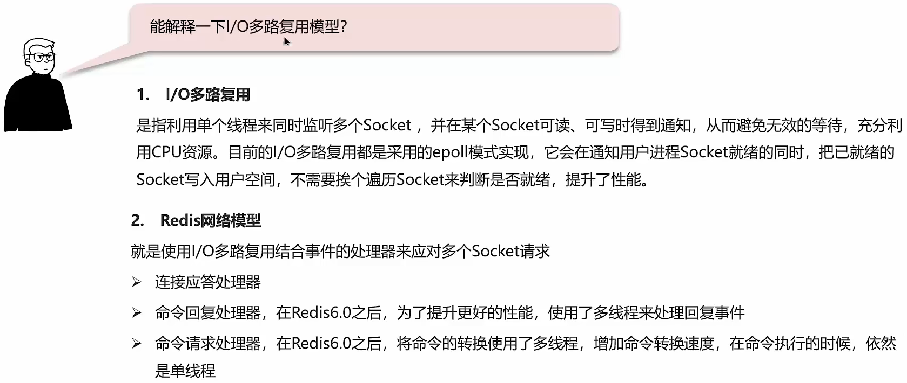

## 用户空间和内核空间
+ Linux 系统中一个进程使用的内存情况划分两部分：**内核空间、用户空间**
+ **用户空间**只能执行受限的命令（Ring3），而不能直接调用系统资源，必须通过内核提供的接口来访问
+ **内核空间**可以执行特权命令（Ring0），调用一切系统资源

在消息发送的时候，Linux 系统为了提高 IO 效率，会在用户空间和内核空间都加入缓冲区：

+ 写数据时，要把用户缓冲数据拷贝到内核缓冲区，然后写入设备
+ 读数据时，要从设备读取数据到内核缓冲区，然后拷贝到用户缓冲区

## 阻塞IO
顾名思义，阻塞 IO 就是两个阶段都必须阻塞等待：

**阶段一：**

1. 用户进程尝试读取数据（比如网卡数据）
2. 此时数据尚未到大，内核需要等待数据
3. 此时用户进程也处于阻塞状态

**阶段二：**

1. 数据到达并拷贝到内核缓冲区，代表已就绪
2. 将内核数据拷贝到用户缓冲区
3. 拷贝过程中，用户进程依然阻塞等待
4. 拷贝完成，用户进程解除阻塞，处理数据

## 非阻塞IO
顾名思义，非阻塞 IO 的 recvfrom 操作会立即返回结果而不是阻塞用户进程。

**阶段一：**

1. 用户进程尝试读取数据（比如网卡数据）
2. 此时数据尚未到达，内核需要等待数据
3. 返回异常给用户进程
4. 用户进程拿到 error 后，再次尝试读取
5. 循环往复，直到数据就绪

**阶段二：**

1. 将内核数据拷贝到用户缓冲区
2. 拷贝过程中，用户进程依然阻塞等待
3. 拷贝完成，用户进程解除阻塞，处理数据

可以看到，非阻塞 IO 模型中，用户进程在第一个阶段是非阻塞，第二个阶段是阻塞状态，虽然是非阻塞，但性能并没有得到提高。而且忙等机制会导致 CPU 空转，CPU 使用率暴增。

## IO多路复用
**IO 多路复用：**是利用单个线程来同时监听多个 Socket，并在某个 Socket 可读、可写时得到通知，从而避免无效的等待，充分利用 CPU 资源。

**阶段一：**

1. 用户进程调用 select，指定要监听的 Socket 集合
2. 内核监听对应的多个 Socket
3. 任意一个或多个 Socket 数据就绪则返回 readable
4. 此过程中用户进程阻塞

**阶段二：**

1. 用户进程找到就绪的 Socket
2. 依次调用 recvfrom 读取数据
3. 内核将数据拷贝到用户空间
4. 用户进程处理数据

**IO 多路复用**是利用单个线程来同时监听多个 Socket，并在某个 Socket 可读、可写时得到通知，从而避免无效的等待，充分利用 CPU 资源。不过监听 Socket 的方式、通知的方式又有多种实现，常见的有：

+ **select**
+ **poll**
+ **epoll**

**差异：**

+ select 和 poll 只会通知用户进程有 Socket 就绪，但不确定具体是哪个 Socket，需要用户进程逐个遍历 Socket 来确认
+ epoll 则会在通知用户进程 Socket 就绪的同时，把已就绪的 Socket 写入用户空间

## Redis 网络模型
Redis 通过** IO 多路复用**来提高网络性能，并且支持各种不同的多路复用实现，并且将这些实现进行封装，提供了统一的高性能事件库

## 面试场景

:::tips
**面试官：**Redis是单线程的,但是为什么还那么快?

**候选人:**

嗯，这个有几个原因吧~~~

1、完全基于内存的，C语言编写

2、采用单线程，避免不必要的上下文切换可竞争条件

3、使用多路I/O复用模型，非阻塞IO

例如: bgsave和l bgrewriteaof 都是在后台执行操作，不影响主线程的正常使用，不会产生阻塞

**面试官:**能解释一下I/O多路复用模型?

候选人:嗯~~，I/O多路复用是指利用单个线程来同时监听多个Socket，并在某个Socket可读、可写时得到通知，从而避免无效的等待，充分利用CPU资源。目前的I/O多路复用都是采用的epoll模式实现，它会在通知用户进程Socket就绪的同时，把己就绪的Socket写入用户空间，不需要挨个遍历Socket来判断是否就绪,提升了性能。

其中Redis的网络模型就是使用I/0多路复用结合事件的处理器来应对多个Socket请求，比如，提供了连接应答处理器、命令回复处理器，命令请求处理器;

在Redis6.0之后，为了提升更好的性能，在命令回复处理器使用了多线程来处理回复事件，在命令请求处理器中，将命令的转换使用了多线程，增加命令转换速度，在命令执行的时候，依然是单线程

:::

