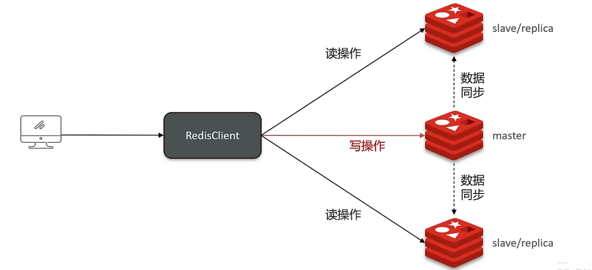
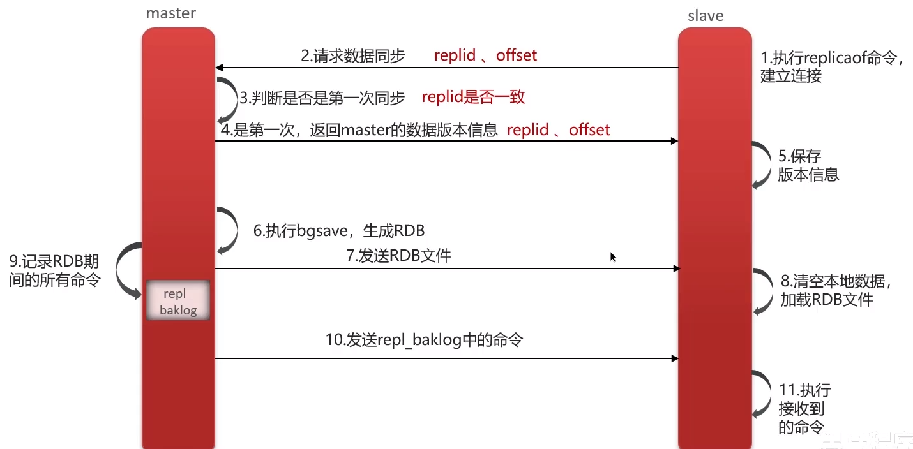
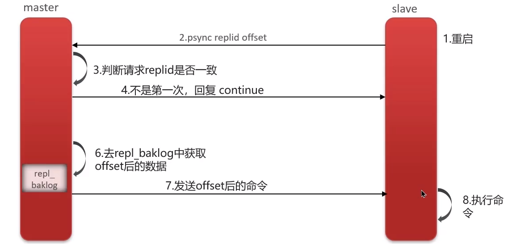

:::tips
Redis集群有哪些方案，知道嘛？

在Redis中提供的集群方案总共有三种

+ 主从复制
+ 哨兵模型
+ 分片集群

:::

**面试官喜欢问到的问题：**

:::tips
1. redis主从数据同步的流程是什么？
2. 怎么保证redis的高并发、高可用？
3. 你们使用redis是单点还是集群，哪种集群？
4. redis分片集群中数据是怎么存储何读取的？
5. redis集群脑裂，该怎么解决呢？

:::

## 主从模式
单节点Redis的并发能力是有上限的，要进一步提高Redis的并发能力，就需要搭建主从集群，实现读写分离。

主节点（master）负责 redis 的写操作，从节点（slave）负责 redis 中的读操作。

当 master 节点接收到写操作的时候，需要把数据同步到从节点 slave 才行，必须保证 master 与 slave 的数据一致性。

## 主从数据同步原理
### 主从全量同步
**Replication Id：**简称replid，是数据集的标记，id一致则说明是同一数据集。每一个master都有唯一的replid，slave则会继承master节点的replid

**offset：**偏移量，随着记录在repl_baklog中的数据增多而逐渐增大。slave完成同步时也会记录当时同步的offset。如果slave的offset小于master的offset，说明slave数据落后于master，需要更新。

### 主从增量同步（slave重启或后期数据变化）

>
> **介绍一下redis的主从同步**
>
> 单节点Redis的并发能力是有上限的，要进一步提高Redis的并发能力，就需要搭建主从集群，实现读写分离。一般都是一主多从，主节点负责写数据，从节点负责读数据。
>
>
>
> **能说一下，主从同步数据的流程吗？**
>
> **全量同步：**
>
> 1. 从节点请求主节点同步数据（replication id、offset）
> 2. 主节点判断是否是第一次请求，是第一次就与从节点同步版本信息（replication id和offset）
> 3. 主节点执行bgsave，生成rdb文件后，发送给从节点去执行
> 4. 在rdb生成执行期间，主节点会以命令的方式记录到缓冲区（一个日志文件repl_baklog）
> 5. 把生成之后的命令日志文件发送给从节点进行同步
>
> **增量同步：**
>
> 1. 从节点请求主节点同步数据，主节点判断不是第一次请求，不是第一次就获得从节点的offset值
> 2. 主节点从命令日志中获取offset值之后的数据，发送给从节点进行数据同步

--- 

## 面试场景
>
> **面试官:** Redis集群有哪些方案,知道嘛？
>
> **候选人:** 嗯~~，在Redis中提供的集群方案总共有三种:主从复制、哨兵模式、Redis分片集群
>
>
>
> **面试官:** 那你来介绍一下主从同步
>
> **候选人:** 嗯，是这样的，单节点Redis的并发能力是有上限的，要进一步提高Redis的并发能力，可以搭建主从集群，实现读写分离。一般都是一主多从，主节点负责写数据，从节点负责读数据，主节点写入数据之后，需要把数据同步到从节点中
>
>
>
> **面试官:** 能说一下，主从同步数据的流程
>
> **候选人:** 嗯~~，好!主从同步分为了两个阶段，一个是全量同步，一个是增量同步
>
> 全量同步是指从节点第一次与主节点建立连接的时候使用全量同步，流程是这样的:
>
> 第一：从节点请求主节点同步数据，其中从节点会携带自己的replication id和offset偏移量。
>
> 第二：主节点判断是否是第一次请求，主要判断的依据就是，主节点与从节点是否是同一个replicatiorid，如果不是，就说明是第一次同步，那主节点就会把自己的replication id和offset发送给从节点，让从节点与主节点的信息保持一致。
>
> 第三:在同时主节点会执行bgsave，生成rdb文件后，发送给从节点去执行，从节点先把自己的数据清空，然后执行主节点发送过来的rdb文件，这样就保持了一致
>
> 当然，如果在rdb生成执行期间，依然有请求到了主节点，而主节点会以命令的方式记录到缓冲区，缓冲区是一个日志文件，最后把这个日志文件发送给从节点，这样就能保证主节点与从节点完全一致了，后期再同步数据的时候，都是依赖于这个日志文件，这个就是全量同步
>
> 增量同步指的是，当从节点服务重启之后，数据就不一致了，所以这个时候，从节点会请求主节点同步数据，主节点还是判断不是第一次请求，不是第一次就获取从节点的offset值，然后主节点从命令日志中获取offset值之后的数据，发送给从节点进行数据同步
>

