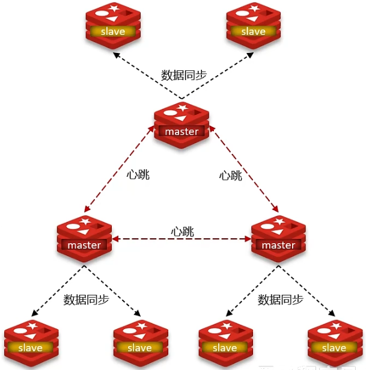
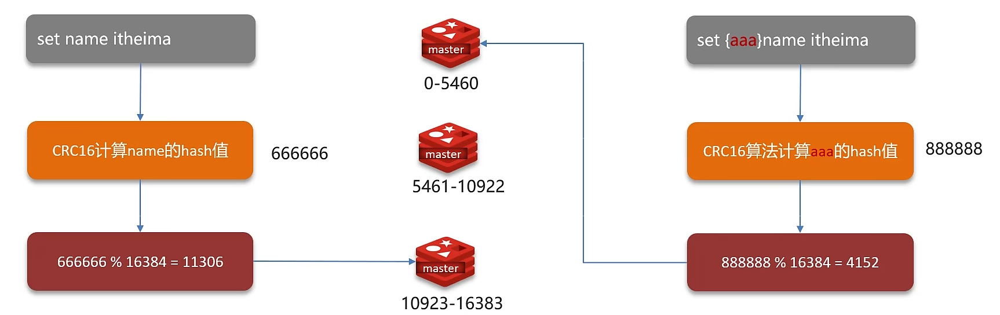

主从和哨兵可以解决高可用、高并发读的问题。但是依然有两个问题没有解决：

+ 海量数据存储问题
+ 高并发写的问题

使用分片集群可以解决上述问题，分片集群特征：

+ 集群中有多个master，每个master保存不同数据
+ 每个master都可以有多个slave节点
+ master之间通过ping监测彼此健康状态
+ 客户端请求可以访问集群任意节点，最终都会被转发到正确节点

## 分片集群结构-数据读写
Redis分片集群引入了哈希槽的概念，Redis集群有16384个哈希槽，每个key通过CRC16校验后对16384取模来决定放置哪个槽，集群的每个节点负责一部分hash槽。

我们可以通过hash值来进行master节点的写操作，当有多个分片集群的master时，我们需要将key（即上图左边的'name'）进行hash计算得到hash值，并将hash值与redis集群中的总hash槽进行取模，得到的结果就对应写入的master是哪个呢。

当然也可以通过上图右边的方式不计算key的hash值，而是计算{aaa}中的hash值。

--- 

## 面试场景
> **redis的分片集群有什么作用？**
> 
> + 集群中有多个master，每个master保存不同的数据
> + 每个master都可以有多个slave节点
> + master之间通过ping监测彼此健康状态
> + 客户端请求可以访问集群任意节点，最终都会被转发到正确节点
> 
> **redis分片集群中数据是怎么存储和读取的？**
> 
> + redis分片集群引入了哈希槽的概念，redis集群有16384个哈希槽
> + 将16384个插槽分配到不同的实例
> + 读写数据：根据key的有效部分计算哈希值，对16384取余（有效部分，如果key前面有大括号，大括号的内容就是有效部分，如果没有，则以key本生做为有效部分）余数做为插槽，寻找插槽所在的实例
> 
> 
> 
>
> **面试官：** redis的分片集群有什么作用
> 
> **候选人：** 分片集群主要解决的是，海量数据存储的问题，集群中有多个master，每个master保存不同数据，并且还可以给每个master设置多个slave节点，就可以继续增大集群的高并发能力。同时每个master之间通过ping监测彼此健康状态，就类似于哨兵模式了。当客户端请求可以访问集群任意节点，最终都会被转发到正确节点
> 
> **面试官：** Redis分片集群中数据是怎么存储和读取的?
> 
> **候选人：**
> 
> 嗯～，在redis集群中是这样的
> 
> Redis集群引入了哈希槽的概念，有16384个哈希槽，集群中每个主节点绑定了一定范围的哈希槽范围，key通过CRC16校验后对16384取模来决定放置哪个槽，通过槽找到对应的节点进行存储。取值的逻辑是一样的

