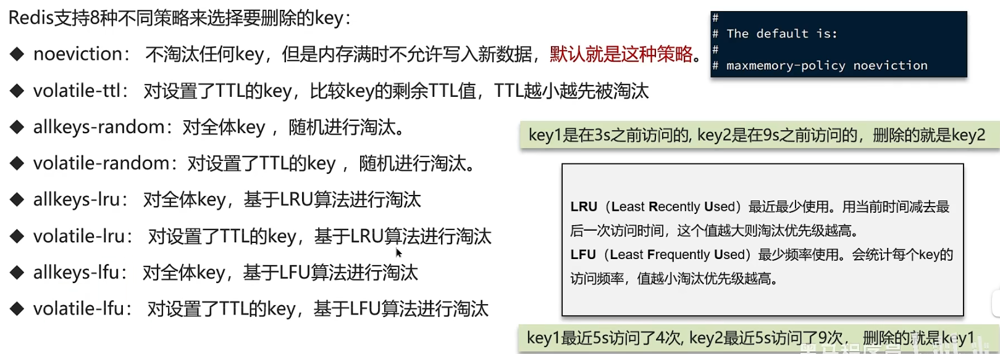
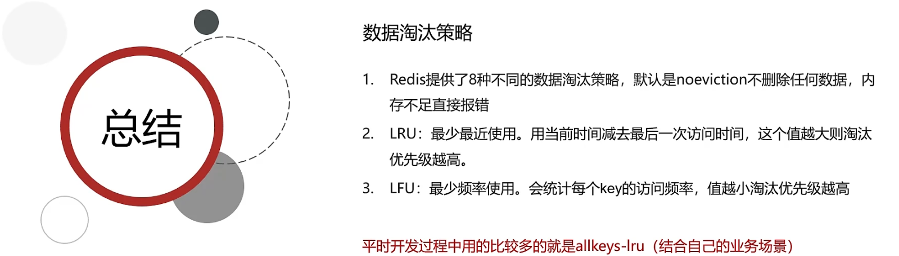

**假如缓存过多，内存是有限的，内存被占满了怎么办？**

其实就是想问redis的数据淘汰策略是什么？

**数据的淘汰策略：**当Redis中的内存不够用时，此时在向Redis中添加新的key，那么Redis就会按照某一种规则将内存中的数据删除掉，这种数据的删除规则被称之为内存的淘汰策略。

### 数据淘汰策略-使用建议
1. 优先使用allkeys-lru策略。充分利用LRU算法的优势，把最近最常访问的数据留在缓存中。如果业务有明显的冷热数据区分，建议使用。
2. 如果业务中数据访问频率差别不大，没有明显冷热数据区分，建议使用allkeys-random，随机选择淘汰。
3. 如果业务中有置顶的需求，可以使用volatile-lru策略，同时置顶数据不设置过期时间，这些数据就一直不被删除，会淘汰其他设置过期时间的数据。
4. 如果业务中有短时高频访问的数据，可以使用allkeys-lfu或volatile-lfu策略。

### 关于数据淘汰策略其他的面试问题
1. 数据库有1000万数据,Redis只能缓存20w数据,如何保证Redis中的数据都是热点数据?

使用 allkeys-lru (挑选最近最少使用的数据淘汰)淘汰策略，留下来的都是经常访问的热点数据

1. Redis 的内存用完了会发生什么?

主要看数据淘汰策略是什么? 如果是默认的配置( noeviction )，会直接报错

### 面试场景
:::tips
**面试官:**Redis的数据淘汰策略有哪些？

**候选人:**

嗯，这个在redis中提供了很多种，默认是noeviction，不删除任何数据，内部不足直接报错

是可以在redis的配置文件中进行设置的，里面有两个非常重要的概念，一个是LRU，另外一个是LFU。

LRU的意思就是最少最近使用，用当前时间减去最后一次访问时间，这个值越大则淘汰优先级越高。

LFU的意思是最少频率使用。会统计每个key的访问频率，值越小淘汰优先级越高

我们在项目设置的是 allkeys-lru，挑选最近最少使用的数据淘汰，把一些经常访问的key留在redis中

**面试官:**数据库有1000万数据,Redis只能缓存20w数据,如何保证Redis中的数据都是热点数据?

**候选人:**

嗯，我想一下~~

可以使用alkeys-lru(挑选最近最少使用的数据淘汰）淘汰策略，那留下来的都是经常访问的热点数据

**面试官:**Redis的内存用完了会发生什么?

:::

