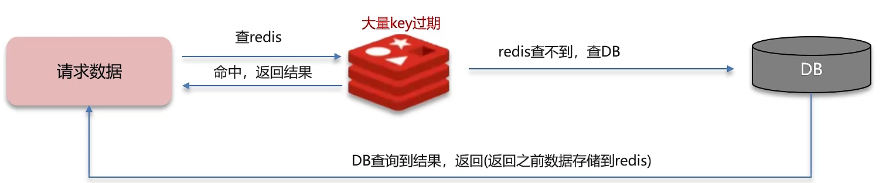

**缓存雪崩**是指在同一时段大量的缓存key同时失效或者Redis服务宕机，导致大量请求到达数据库，带来巨大压力。

## 解决方案：
+ 给不同的Key的TTL添加随机值。（大量的缓存key同时失效）
+ 利用Redis集群提高服务的可用性。比如：哨兵模式、集群模式。（Redis宕机）
+ 给缓存业务添加降级限流策略。常见的限流设置有nginx 或spring cloud gateway。**降级可做为系统的保底策略，适用于穿透、击穿、雪崩。
+ 给业务添加多级缓存。使用Guava 或 Caffeine作为一级缓存，Redis作为二级缓存

## 面试场景
> **面试官:** 什么是缓存雪崩？怎么解决？
> 
> **候选人:**
> 
> 嗯!!
> 
> 缓存雪崩意思是设置缓存时采用了相同的过期时间，导致缓存在某一时刻同时失效，请求全部转发到DB，DB瞬时压力过重雪崩。与缓存击穿的区别:雪崩是很多key，击穿是某一个key缓存。
> 
> 解决方案主要是可以将缓存失效时间分散开，比如可以在原有的失效时间基础上增加一个随机值，比如1-5分钟随机，这样每一个缓存的过期时间的重复率就会降低，就很难引发集体失效的事件。
