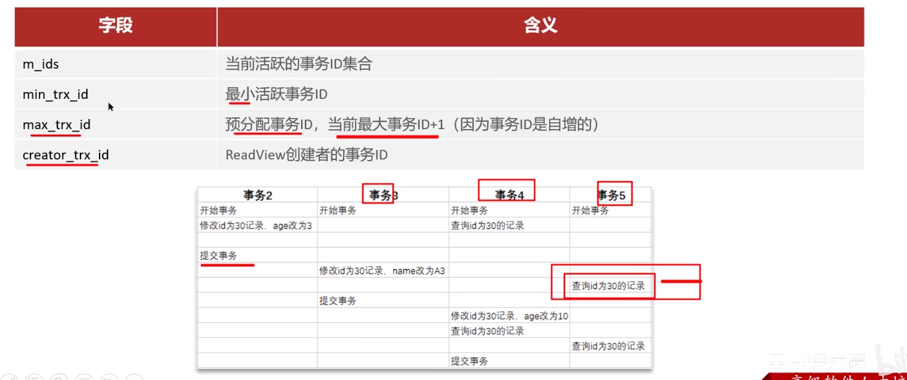

**🗨️** **事务中的隔离性是如何保证的呢？**

**锁：** 排他锁（如果一个事务获取了一个数据行的排他锁，其他事务就不能再获取该行的其他锁）

**mvcc：** 多版本并发控制

### MVCC
全称 **Multi-Version Concurrency Control**，多版本并发控制。指维护一个数据的多个版本，使得读写操作没有冲突。

**MVCC** 的具体实现，主要依赖于数据库记录中的隐式字段、undo log 日志、readView。

#### MVCC-实现原理
+ **记录中的隐藏字段**

+ **undo log**

回滚日志，在 insert、update、delete 的时候产生的便于数据回滚的日志。

当 insert 的时候，产生的 undo log 日志只在回滚时需要，在事务提交后，可被立即删除。

而 update、delete 的时候，产生的 undo log 日志不仅在回滚时需要，mvcc 版本访问也需要，不会立即被删除。

+ **undo log 版本链**

不同事务或相同事务对同一条记录进行修改，会导致该记录的 undolog 生成一条记录版本链表，链表的头部是最新的旧纪录，链表尾部是最早的旧纪录。

+ **readview**

readview（读视图）是 **快照读** SQL 执行时 MVCC 提取数据的依据，记录并维护系统当前活跃的事务（未提交的）id。

+ **当前读**

读取的是记录的最新版本，读取时还要保证其他并发事务不能修改当前记录，会对读取的记录进行加锁。对于我们日常的操作，如：select ... lock in share mode（共享锁），select ... for update、update、insert、delete（排他锁）都是一种当前读。

+ **快照读**

简单的 select（不加锁）就是快照读，快照读，读取的是记录数据的可见版本，有可能是历史数据，不加锁，是非阻塞读。

    - Read Committed：每次 select，都生成一个快照读
    - Repeatable Read：开启事务后第一个 select 语句才是快照读的地方

#### readView 中包含的四个核心字段：

#### readView 数据访问规则

不同隔离级别，生成的 ReadView 的时机不同：

+ READ COMMITTED：在事务中每一次执行快照读时生成 ReadView
+ REPEATABLE READ：仅在事务中第一次执行快照读时生成 ReadView，后续复用该 ReadView

#### RC 隔离级别下
RC 隔离级别下，在事务中每一次执行快照读时生成 ReadView。

#### RR 隔离级别下
RR 隔离级别下，仅在事务中第一次执行快照读时生成 ReadView，后续复用该 ReadView。

### 面试场景
**🗨️** **事务中的隔离性是如何保证的呢？（你解释一下 MVCC）**

**MVCC 是 MySQL 中多版本并发控制。指维护一个数据的多个版本，使得读写操作没有冲突，主要实现分为三块内容**

+ **隐藏字段**
    - trx_id（事务 id），记录每一次操作的事务 id，是自增的
    - roll_pointer（回滚指针），指向上一个版本的事务版本记录地址
+ **undo log**
    - 回滚日志，存储老版本数据
    - 版本链：多个事务并行操作某一行记录，记录不同事务修改数据的版本，通过 roll_pointer 指针形成一个链表
+ **readView 解决的是一个事务查询选择版本的问题**
    - 根据 readView 的匹配规则和当前的一些事务 id 判断该访问哪个版本的数据
    - 不同的隔离级别快照读是不一样的，最终的访问的结果不一样
        * RC：每一次执行快照读时生成 ReadView
        * RR：仅在事务中第一次执行快照读时生成 ReadView，后续复用

***
    
> **面试官:事务中的隔离性是如何保证的呢?〔你解释一下MVCC)**
> 
> **候选人:** 事务的隔离性是由锁和mvcc实现的。
> 
> 其中mvcc的意思是多版本并发控制。指维护一个数据的多个版本，使得读写操作没有冲突，它的底层实现主要是分为了三个部分，
> 
> 第一个是隐藏字段，第二个是undo log日志，第三个是readView读视图
> 
> 隐藏字段是指:在mysql中给每个表都设置了隐藏字段，有一个是trx_id(事务id)，记录每一次操作的事务id，是自增的;另一个字段是roll_pointer(回滚指针)，指向上一个版本的事务版本记录地址
> 
> undo log主要的作用是记录回滚日志，存储老版本数据，在内部会形成一个版本链，在多个事务并行操作某一行记录，记录不同事务修改数据的版本，通过roll_pointer指针形成一个链表
> 
> readView解决的是一个事务查询选择版本的问题，在内部定义了一些匹配规则和当前的一些事务id判断该访问那个版本的数据，不同的隔离级别快照读是不一样的，最终的访问的结果不一样。如果是rc隔离级别，每一次执行快照读时生成ReadView，如果是rr隔离级别仅在事务中第一次执行快照读时生成ReadView，后续复用
> 

