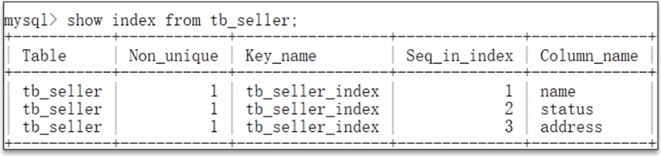
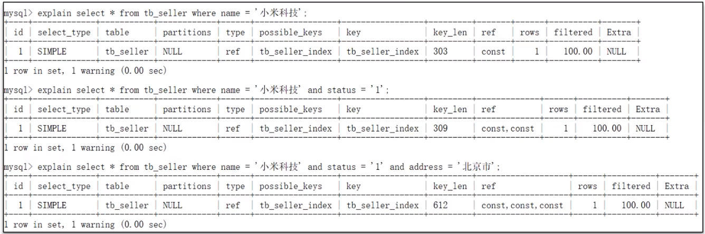
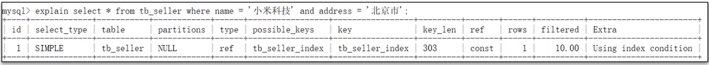
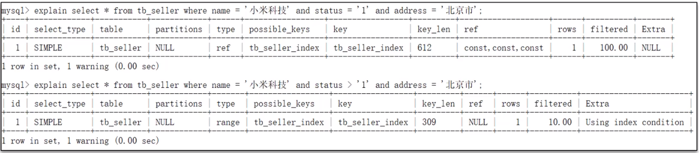
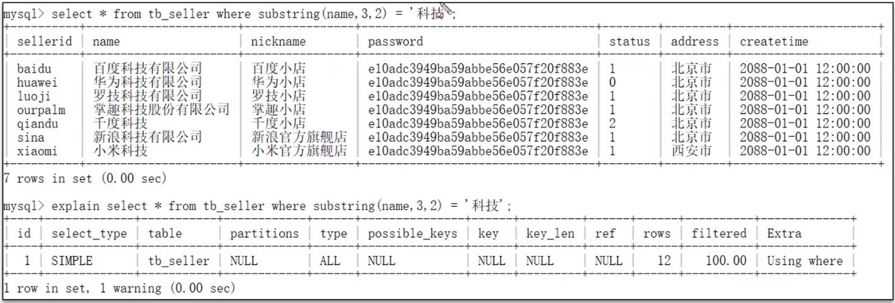
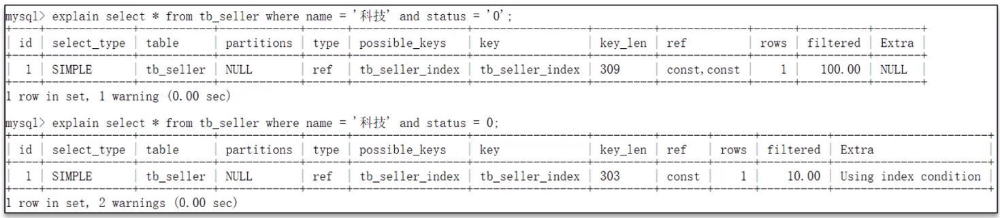
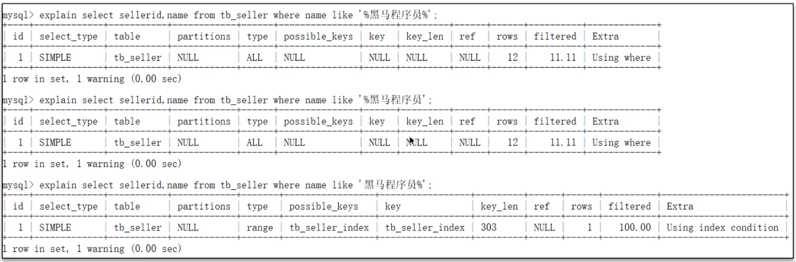

**🗨️** ** ** **什么情况下索引会失效？**

索引失效的情况有很多，可以说一些自己遇到过的，不要张口就得得得说一堆背诵好的面试题（适当的思考一下，回想一下，更真实）

首先准备好了一张表，给 tb_seller 创建联合索引，字段顺序：name, status, address

那么以我们所学的知识能否砍断索引是否失效了呢？

我们可以使用执行计划 explain 来判断索引是否失效

### 什么情况下索引会失效？
1. **违反了最左前缀法则**

如果索引了多列，要遵守最左前缀法则。指的是查询从索引的最左前列开始，并且不跳过索引中的列。匹配最左前缀法则，走索引：

违法最左前缀法则，索引失效：

如果符合最左法则，但是出现跳跃某一列，只有最左列索引生效：

2. **范围查询右边的列，不能使用索引**

这里 status > '1' 之后的 address 不能使用索引，因为是在范围查询的右边。

根据前面的两个字段 name, status 查询是走索引的，但是最后一个条件 address 没有用到索引。

3. **不要再索引列上进行运算操作，索引将会失效**

4. **字符串不加单引号，造成索引失效**

由于，在查询时，没有对字符串加单引号，MySQL 的查询优化器，会自动的进行类型转换，造成索引失效。

****

5. **以 % 开头的 Link 模糊查询，索引失效。如果仅仅是尾部模糊查询，索引不会失效。如果是头部模糊查询，索引失效**

### 面试场景
**🗨️**** ****什么情况下索引会失效？**

1. 违法最左前缀法则
2. 范围查询右边的列，不能使用索引
3. 不要在索引列上进行运算操作，索引将失效
4. 字符串不加单引号，造成索引失效。（类型转换）
5. 以 % 开头的 Link 模糊查询，索引失效

:::success
**面试官:什么情况下索引会失效?**

**候选人:**嗯，这个情况比较多，我说一些自己的经验，以前遇到过的

比如，索引在使用的时候没有遵循最左匹配法则，第二个是，模糊查询，如果%号在前面也会导致索引失效。如果在添加索引的字段上进行了运算操作或者类型转换也都会导致索引失效。

我们之前还遇到过一个就是，如果使用了复合索引，中间使用了范围查询，右边的条件索引也会失效

所以，通常情况下，想要判断出这条sql是否有索引失效的情况，可以使用explain执行计划来分析

:::

