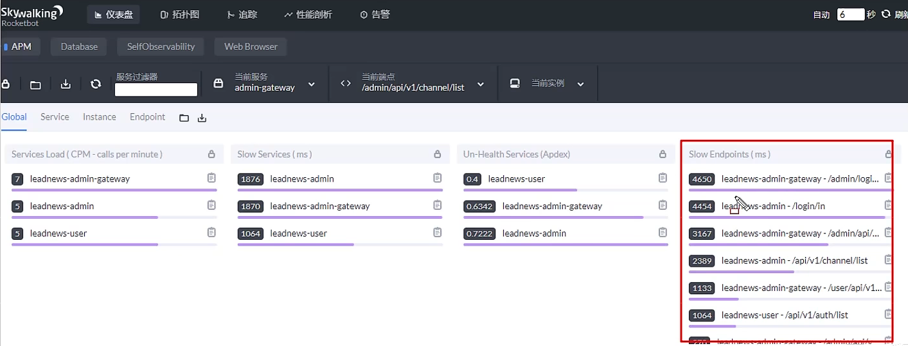
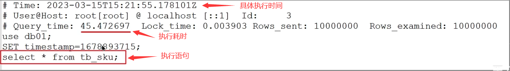

面试官可能会问道的问题：


通常情况下，慢查询出现的情况有这些：

1. 聚合查询
2. 多表查询
3. 表数据量过大查询
4. 深度分页查询

主要的表现形式为：页面加载过慢、接口压测响应时间过长（超过1s）

假如你的业务就是比较慢，那你如何确定是SQL查询慢还是业务其他操作导致缓慢的呢？就算是SQL问题，如何能够找出执行慢的SQL呢？

## 如何定位慢查询？

通常，我们可以使用一些开源的工具来做调试。

### 方案一：开源工具

+ **调试工具：** **<font style="color:#ED740C;">Arthas（阿尔萨斯）</font>**
+ **运维工具：** **<font style="color:#ED740C;">Prometheus（普罗米修斯）</font>** **、** **<font style="color:#ED740C;">
  Skywalking</font>**

Skywalking可以实时查看接口的情况：



### 方案二：MySQL自带慢日志

慢查询日志记录了所有执行时间超过指定参数（log_query_time，单位：秒，默认10秒）的所有 SQL 语句的日志。如果要开启慢查询日志，需要在
MySQL的配置文件（/etc/my.cnf）中配置如下信息：

```shell
# 开启MySQL慢日志查询开关
slow_query_log = 1
# 设置慢日志的时间为2秒，SQL 语句执行时间超过2秒，就会视为慢查询，记录慢查询日志
long_query_time = 2
```

配置完毕之后，通过以下指令重新启动 MySQL 服务器进行测试，查看慢日志文件中记录的信息 /var/lib/mysql/localhost-slow.log。



## 面试场景

<font style="color:#DF2A3F;">🗨️</font>**<font style="color:#DF2A3F;"> 如何定位慢查询？</font>**

1. 介绍以下当时产生问题的场景（我们当时的一个接口测试的时候非常的慢，压测的结果大概5秒钟）
2. 我们系统中当时采用了运维工具（Skywalking），可以检测出哪个接口，最终是 sql 的问题
3. 在 mysql 中开启了慢日志查询，我们设置的值就是2秒，一旦 sql 执行超过2秒就会记录到日志中（调试阶段）

> **面试题的参考回答**
>
> **面试官：** MySQL中，如何定位慢查询？
>
> **候选人：**
>
> 嗯~，我们当时做压测的时候有的接口非常的慢，接口的响应时间超过了2秒以上，因为我们当时的系统部署了运维的监控系统
> Skywalking，在展示的报表中可以看到是哪一个接口比较慢，并且可以分析这个接口哪部分比较慢，这里可以看到 SQL
> 的具体的执行时间，所以可以定位是哪个
> sql 出了问题
>
> 如果，项目中没有这种运维的监控系统，其实在 MySQL中也提供了慢日志查询的功能，可以在 MySQL的系统配置文件中开启这个慢日志的功能，并且也可以设置
> SQL 执行超过多少时间来记录到一个日志文件中，我记得上一个项目配置的是2秒，只要
> SQL执行的时间超过了2秒就会记录到日志文件中，我们就可以在日志文件中找到执行比较慢的
> SQL 了。

