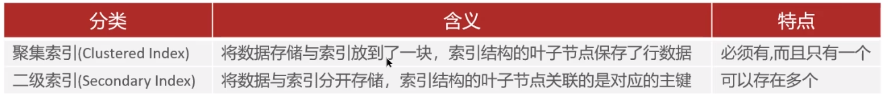
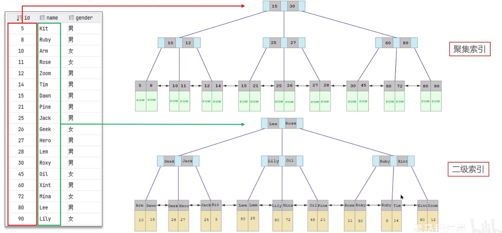

+ 什么是聚簇索引，什么是非聚簇索引？
+ 什么是聚集索引，什么是二级索引（非聚集索引）
+ 什么是回表？

### 聚集索引（聚簇索引）与二级索引（非聚簇索引）

聚集索引选取规则：

+ 如果存在主键，主键索引就是聚集索引
+ 如果不存在主键，将使用第一个唯一（UNIQUE）索引作为聚集索引
+ 如果表没有主键，也没有合适的唯一索引，则 InnoDB 会自动生成一个 rowid 作为隐藏的聚集索引

可以看到，聚集索引叶子节点存储的是（主键值：行数据），而二级索引叶子节点存储的是（索引名：主键值）

### 回表查询

### 面试场景
🗨️** 什么是聚簇索引，什么是非聚簇索引？**

1. 聚簇索引（聚集索引）：数据与索引放到一块，B+树的叶子节点保存了整行数据，有且只有一个
2. 非聚簇索引（二级索引）：数据与索引分开存储，B+树的叶子节点保存对应的主键，可以有多个

🗨️** 知道什么是回表查询吗？**

通过二级索引找到对应的主键值，再到聚集索引中查找整行数据，这个过程就是回表

> 
> **面试官:什么是聚簇索引什么是非聚簇索引?**
> 
> **候选人:**
> 
> 好的~，聚簇索引主要是指数据与索引放到一块，B+树的叶子节点保存了整行数据，有且只有一个，一般情况下主键在作为聚簇索引的
> 
> 非聚簇索引值的是数据与索引分开存储，B+树的叶子节点保存对应的主键，可以有多个，一般我们自己定义的索引都是非聚簇索引
> 
> 
> 
> **面试官:知道什么是回表查询嘛?**
> 
> 候选人:嗯，其实跟刚才介绍的聚簇索引和非聚簇索引是有关系的，回表的意思就是通过二级索引找到对应的主键值，然后再通过主键值找到聚集索引中所对应的整行数据，这个过程就是回表
> 
> 【备注:如果面试官直接问回表，则需要先介绍聚簇索引和非聚簇索引】

