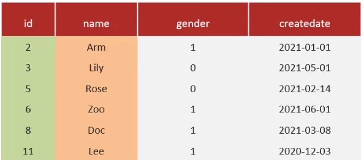

### 覆盖索引
**<font style="color:#DF2A3F;">🗨️</font>** **<font style="color:#DF2A3F;"> </font>** **知道什么是覆盖索引嘛？**

**覆盖索引**是指查询使用了索引，并且需要返回的列，在该索引中已经全部能够找到。



+ i**d 为主键，默认是主键索引**
+ **name 字段为普通索引**

下面的 SQL 查询语句中，是覆盖索引的是：

```sql
select * from tb_user where id = 1
select id, name from tb_user where name = 'Arm'
select id, name ,gender from tb_user where name = 'Arm'
```

1. **是覆盖索引，通过主键索引查询**
2. **是覆盖索引，通过二级索引查询**
3. **不是覆盖索引，gender 需要进行回表查询**

### MySQL 超大分页处理
在数据量比较大时，如果进行 limit 分页查询，在查询时，越往后，分页查询效率越低。

我们一起来看看执行 limit 分页查询耗时对比：


因为，当在进行分页查询时，如果执行 limit 9000000,10，此时需要 MySQL 排序前 9000010 记录，仅仅返回 9000000-9000010 的记录，其他记录丢弃，查询排序的代价非常大。

**优化思路：** 一般分页查询时，通过创建<font style="color:#DF2A3F;">覆盖索引</font>能够比较好地提高性能，可以通过<font style="color:#DF2A3F;">覆盖索引</font>加<font style="color:#DF2A3F;">子查询</font>形式进行优化


### 面试场景
**<font style="color:#DF2A3F;">🗨️</font>** **<font style="color:#DF2A3F;"> </font>** **知道什么是覆盖索引嘛？**

覆盖索引是指查询使用了索引，返回的列，必须在索引中全部能够找到

+ 使用 id 查询，直接走聚集索引查询，依次索引扫描，直接返回数据，性能高。
+ 如果返回的列中没有创建索引，有可能会触发回表查询，尽量避免使用 `select *`


**<font style="color:#DF2A3F;">🗨️</font>** **<font style="color:#DF2A3F;"> </font>** **MySQL 超大分页怎么处理？**

问题：在数据量比较大时，limit 分页查询，需要对数据进行排序，效率低

解决方案：覆盖索引+子查询


> **面试官:知道什么叫覆盖索引嘛?**
> 
> **候选人:嗯～，清楚的**
> 
> 覆盖索引是指select查询语句使用了索引，在返回的列，必须在索引中全部能够找到，如果我们使用id查询，它会直接走聚集索引查询，一次索引扫描，直接返叹数据，性能高。
> 
> 如果按照二级索引查询数据的时候，返回的列中没有创建索引，有可能会触发回表查询，尽量避免使用select*，尽量在返回的列中都包含添加索引的字段
> 
> 
> 
> **面试官:MYSQL超大分页怎么处理?**
> 
> 候选人:嗯，超大分页一般都是在数据量比较大时，我们使用了limit分页查询，并且需要对数据进行排序，这个时候效率就很低，我们可以采用覆盖索引和子查询来解决
> 
> 先分页查询数据的id字段，确定了id之后，再用子查询来过滤，只查询这个id列表中的数据就可以了因为查询id的时候，走的覆盖索引，所以效率可以提升很多


